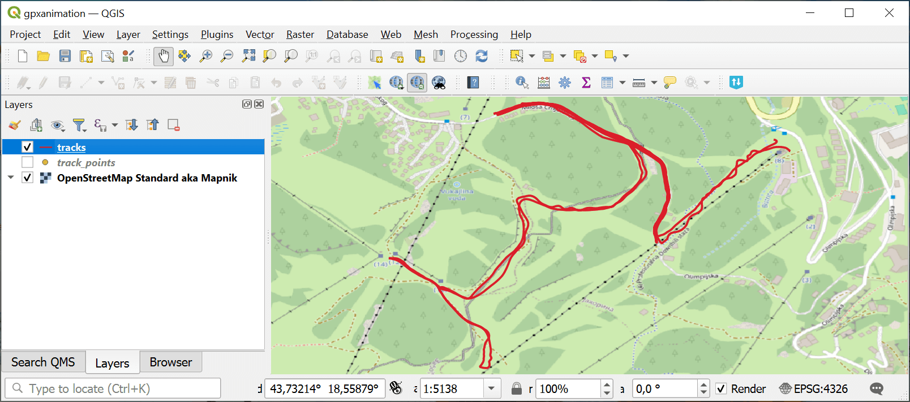
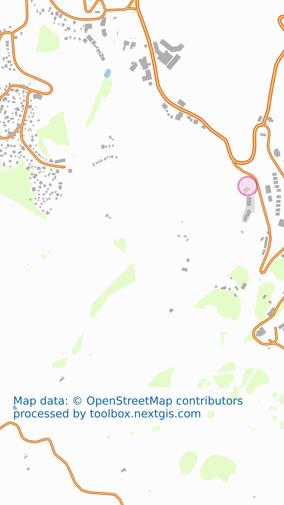

GPS track animation for Social Media
====================================

Generate video dinamically drawing the line of your track on a map for posting in social networks like Instagram and TikTok. 

Video is designed for simplicity: it has vertical aspect ratio and does not have labels. You will be able to overlay markers or labels while posting on social media.

Inputs:

* GPX file with track

Outputs:

* MP4 video

Launch the tool: https://toolbox.nextgis.com/t/gpxanimation

Example:

   Example input

   Example output

**Try the tool in action**

1. Click on the **Demo** button above the tool form. The fields are filled in with demo values.
2. Click on the **Run** button.

.. admonition:: Related tools

   * `Split GPX file by days <https://toolbox.nextgis.com/t/gpxdailysplit?from-related-tools=1>`_
   * `Merge GPX files <https://toolbox.nextgis.com/t/gpxmerge?from-related-tools=1>`_
   * `Clip GPX file by bounding box <https://toolbox.nextgis.com/t/gpxclipbbox>`_
