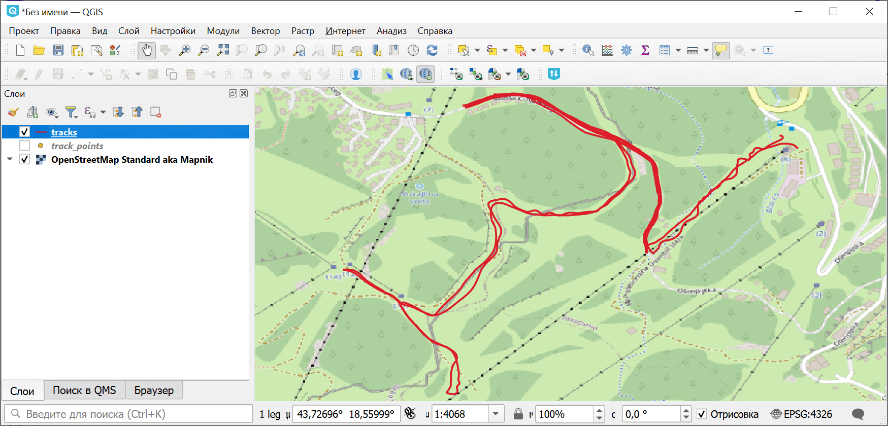

Анимация GPS-трека
==================

Генерация видео с рисованием gps-трека на карте. Видео получится в вертикальном формате и без подписей. Вы сможете наложить маркеры и нужные надписи в редакторе при публикации в вашей соцсети.

На входе:

* Файл GPX. Файл GPX с треком

На выходе:

* Результат. Файл результата

Запуск инструмента: https://toolbox.nextgis.com/t/gpxanimation

Пример работы инструмента:

   Исходный трек в QGIS

.. figure:: _static/gpxanimation_result.gif
   :name: gpxanimation_result_pic
   :align: center
   :width: 8cm

   Пример результата работы инструмента

**Попробуйте инструмент в действии**

1. Нажмите кнопку **Демо** над формой инструмента. Поля будут автоматически заполнены демонстрационными значениями.
2. Нажмите кнопку **Запустить**.

.. seealso::

   * `Разрезать GPX трек по дням <https://toolbox.nextgis.com/t/gpxdailysplit?from-related-tools=1>`_
   * `Объединение GPX файлов <https://toolbox.nextgis.com/t/gpxmerge?from-related-tools=1>`_
   * `Обрезать GPX файл по прямоугольнику <https://toolbox.nextgis.com/t/gpxclipbbox>`_
