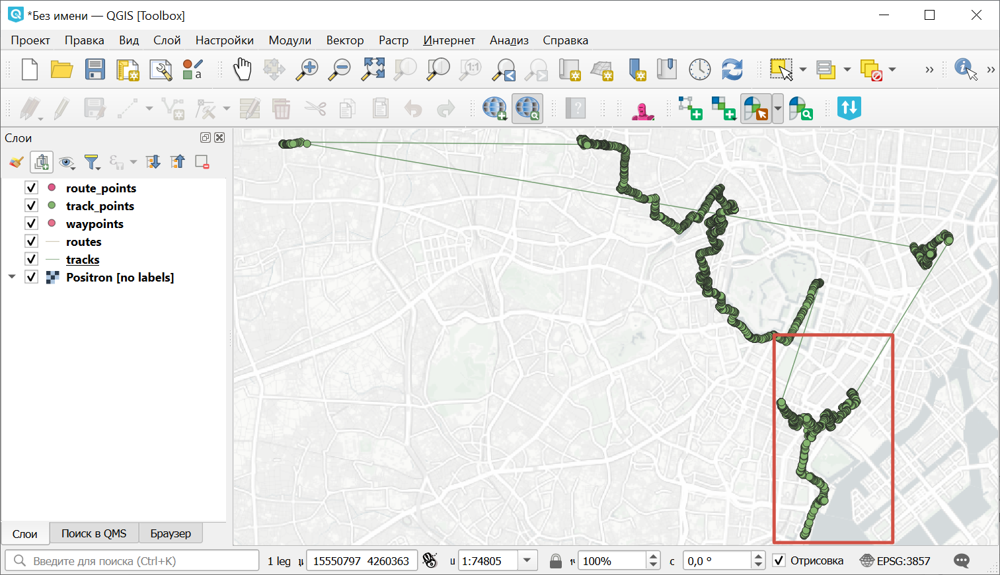
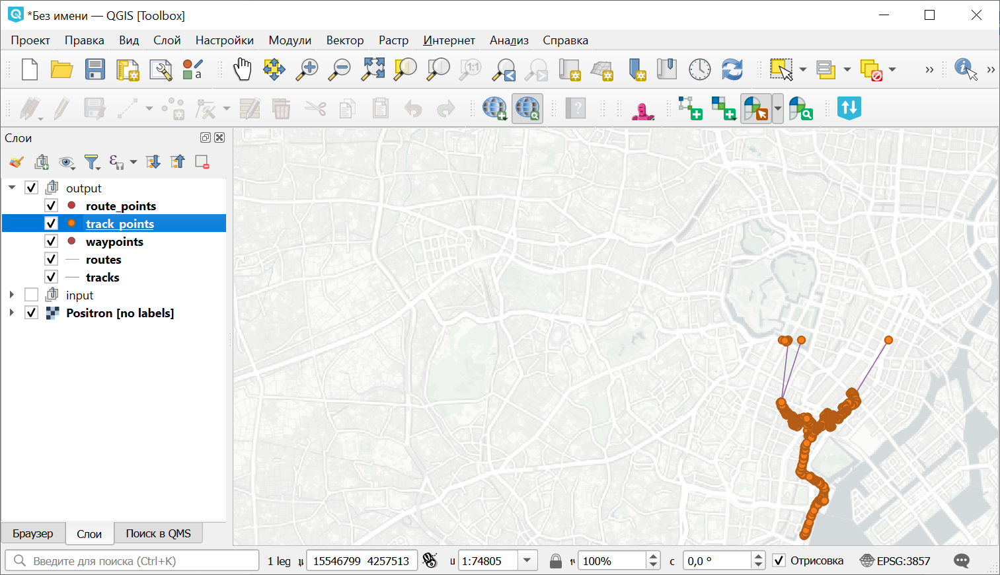

Обрезка GPX файла по прямоугольнику
===================================

Обрезает треки, сохранённые в формате GPX, по области, выделенной прямоугольником. Это помогает, если нужно удалить, например, выбросы, результаты глушения, или просто область за границей ваших интересов 

На входе:

* GPX файл или ZIP архив с одним файлом GPX. Допустимы вложенные каталоги;
* Границы прямоугольника - можно нарисовать на карте, нарисовать и подкорректировать полученные значения или ввести вручную в формате xmin, xmax, ymin, ymax в системе координат WGS 84 (EPSG:4326), например,  ``139.75282797783194,35.62931134243268,139.77938217891602,35.677314929949524``.

На выходе:

* Обрезаный GPX-файл.

Запуск инструмента: https://toolbox.nextgis.com/t/gpxclipbbox

Пример работы инструмента:

   Пример исходных данных, красным выделен прямоугольник, по которому будет делаться обрезка

   Треки, обрезанные по выделенной области

**Попробуйте инструмент в действии**

1. Нажмите кнопку **Демо** над формой инструмента. Поля будут автоматически заполнены демонстрационными значениями.
2. Нажмите кнопку **Запустить**.

.. seealso::

   * `Разбивка GPX-файла по дням <https://toolbox.nextgis.com/t/gpxdailysplit?from-related-tools=1>`_
   * `Объединение GPX файлов <https://toolbox.nextgis.com/t/gpxmerge?from-related-tools=1>`_
   * `Статистика по точкам и трекам в полигонах из NGW <https://toolbox.nextgis.com/t/points_on_tracks_stats?from-related-tools=1>`_