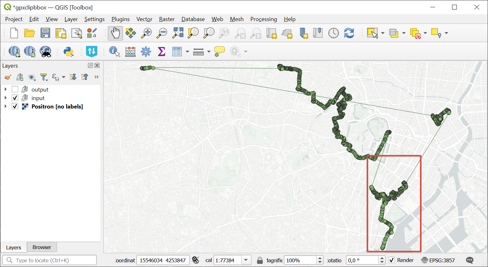
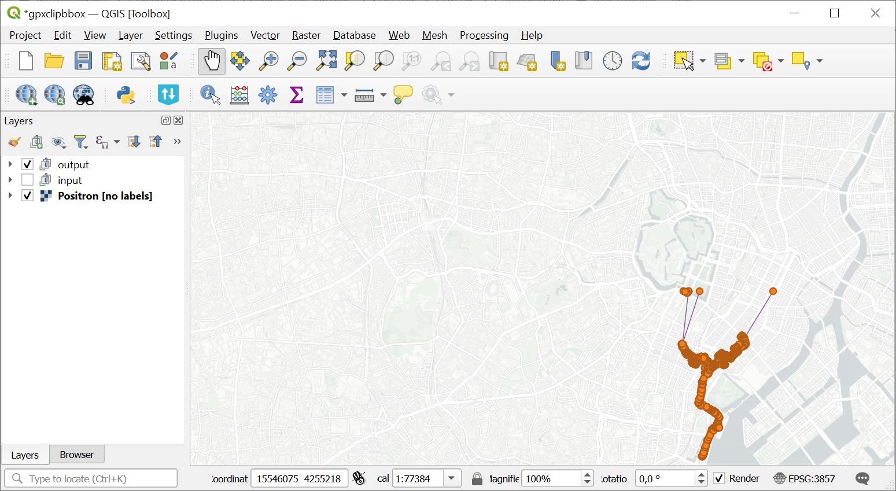

Clip GPX file by bounding box
=============================

Clip one GPX file by rectangular area to remove errors from signal bouncing or just trim the data to the exact area of interest.

Inputs:

* One GPX file or ZIP archive with one GPX file. Subdirectories are allowed;
* Extent bounding box - you can mark it on a map, draw it and then correct the numbers or enter the extent manually following the format 'xmin, xmax, ymin, ymax'. Enter coordinates in WGS 84 (EPSG:4326), for example ``139.75282797783194,35.62931134243268,139.77938217891602,35.677314929949524``.

Outputs:

* Clipped GPX file.

Launch the tool: https://toolbox.nextgis.com/t/gpxclipbbox

Example:

   Example input. The area of iterest is marked in red

   Example output. Track is clipped by the selected area

**Try the tool in action by downloading our example:**

`Input data set <https://nextgis.ru/data/toolbox/gpxclipbbox/gpxclipbbox_inputs.zip>`_ to test the tool. The archive contains step-by-step instructions.

`Result example <https://nextgis.ru/data/toolbox/gpxclipbbox/gpxclipbbox_outputs.zip>`_ of the tool run.

.. admonition:: Related tools

   * `Split GPX file by days <https://toolbox.nextgis.com/t/gpxdailysplit?from-related-tools=1>`_
   * `Merge GPX files <https://toolbox.nextgis.com/t/gpxmerge?from-related-tools=1>`_
   * `Statistics of points and tracks in polygons from NGW <https://toolbox.nextgis.com/t/points_on_tracks_stats?from-related-tools=1>`_