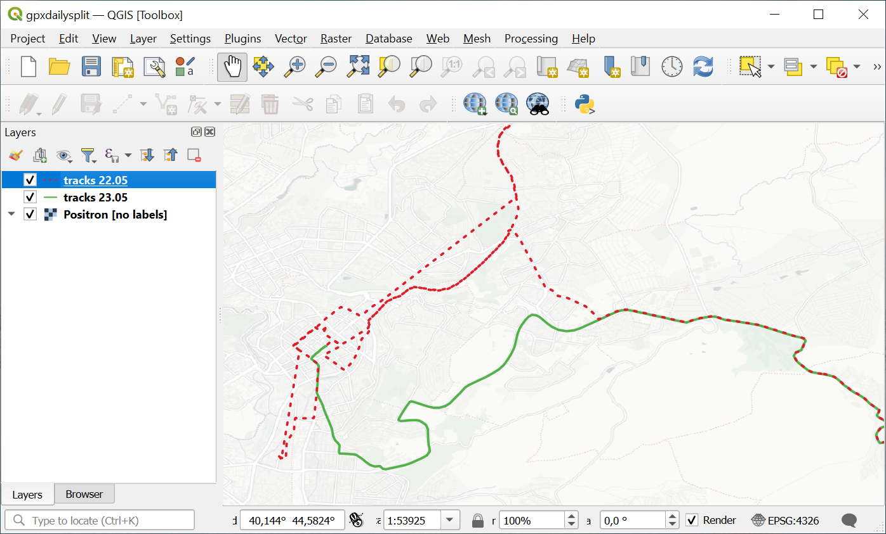

Split GPX file by days
======================

Splits a GPX file tracks and waypoints by days (cut by midnight) and saves each day's data to a separate GPX file.

Inputs:

* GPX file. Needs to be a single file. If you have several files, first merge them using `gpxmerge tool <https://toolbox.nextgis.com/t/gpxmerge>`_;
* Time zone. GPX tracks store time in UTC. To split tracks at midnight, provide the time difference from UTC, ex. ``+09:00``.

Outputs:

* ZIP archive containing GPX files, one for each day.

Launch the tool: https://toolbox.nextgis.com/t/gpxdailysplit

   Tracks split by date on a map

**Try the tool in action**

1. Click on the **Demo** button above the tool form. The fields are filled in with demo values.
2. Click on the **Run** button.

.. admonition:: Related tools

   * `Clip GPX file by bounding box <https://toolbox.nextgis.com/t/gpxclipbbox?from-related-tools=1>`_
   * `Merge GPX files <https://toolbox.nextgis.com/t/gpxmerge?from-related-tools=1>`_
   * `Statistics of points and tracks in polygons from NGW <https://toolbox.nextgis.com/t/points_on_tracks_stats?from-related-tools=1>`_