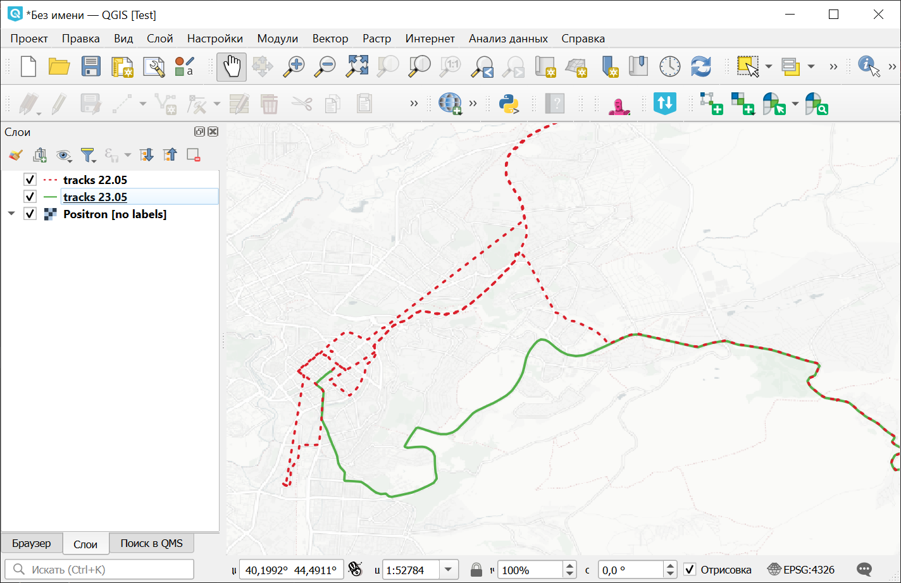

Разрезать GPX трек по дням
==========================

Разделяет треки из GPX-файла по дням и сохраняет каждый день в отдельный файл.

На входе:

* Исходный GPX-файл, который следует разрезать по дням. Если у вас много файлов, то сначала склейте их в один инструментом `gpxmerge <https://toolbox.nextgis.com/t/gpxmerge>`_;
* Часовой пояс. В GPX время треков записано в UTC. Для разделения дней точно по полуночи задайте смещение времени от UTC, например ``+05:00``.

На выходе:

* ZIP-архив с GPX-файлами, по одному файлу на каждый день.

Запуск инструмента: https://toolbox.nextgis.com/t/gpxdailysplit

   Треки, разбитые по датам, на карте

**Попробуйте инструмент в действии, скачав наш пример:**

`Набор исходных данных <https://nextgis.ru/data/toolbox/gpxdailysplit/gpxdailysplit_inputs_ru.zip>`_ для проверки работы инструмента. Внутри архива пошаговая инструкция.

`Пример результата <https://nextgis.ru/data/toolbox/gpxdailysplit/gpxdailysplit_outputs_ru.zip>`_ работы инструмента.

.. seealso::

   * `Обрезать GPX файл по прямоугольнику <https://toolbox.nextgis.com/t/gpxclipbbox?from-related-tools=1>`_
   * `Объединение GPX файлов <https://toolbox.nextgis.com/t/gpxmerge?from-related-tools=1>`_
   * `Статистика по точкам и трекам в полигонах из NGW <https://toolbox.nextgis.com/t/points_on_tracks_stats?from-related-tools=1>`_