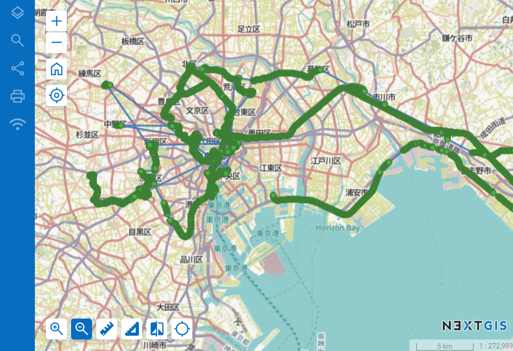
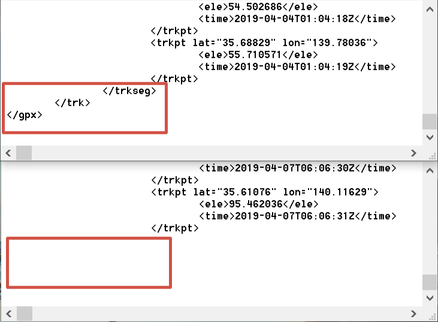

.. sectionauthor::  <grigorenko.j@gmail.com>

Merge GPX files
========================

Merge multiple GPS logs in GPX format to one. Most programms open tracks one by one. With this instrument you don't have to know in advance what day the information for a certain area was collected, all tracks will be viewed at once. 

   Multiple merged tracks on a Web Map

Additionaly, some apps and devices in case of power down leave GPX file without closing tags, making them impossible to open in some programms. This instrument fixes such files.

   End of GPX file with proper closing tags and without them

Input: ZIP archive with GPX files. Subdirectories are allowed

* Subdirectories of several leverls are allowed.

.. important::
	Archives inside the archive are not supported. 

* You can have files with the same name in different folders, the tool can process them anyway.

Output: GPX file.

Launch instrument: https://toolbox.nextgis.com/operation/gpxmerge

**Try it out using our sample:**

Download `input dataset <https://nextgis.com/data/toolbox/gpxmerge/gpxmerge_inputs.zip>`_ to test the instrument. Step-by-step instructions included.

Get the `output <https://nextgis.com/data/toolbox/gpxmerge/gpxmerge_outputs.zip>`_ to additionally check the results.
