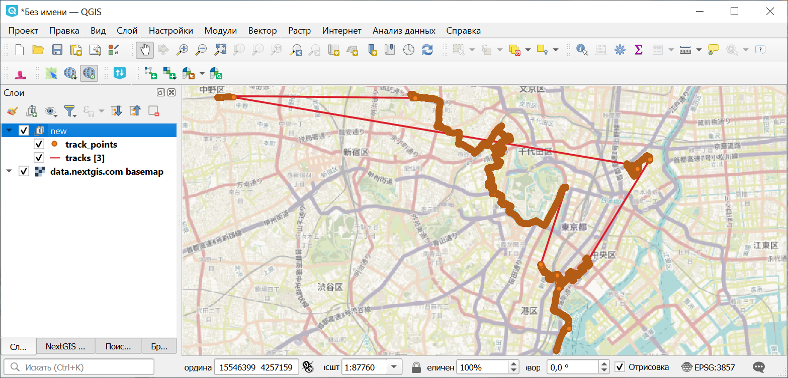

Объединение GPX файлов 
========================

Объединяет GPS треки в формате GPX в один. Большинство программ открывает треки по одному, но благодаря этому инструменту нет необходимости выяснять, в какую дату был записан трек нужного места, можно открыть все собранные данные сразу.

   Множество треков единым слоем на карте

Кроме того, инструмент позволяет починить файлы GPX, повреждённые при при выключении питания.

На входе: 

* ZIP архив с GPX файлами. В архиве могут быть многократно вложенные папки. Файлы в разных папках внутри архива могут называться одинаково, инструмент их примет.
* Режим - выберите из списка:

   * **Точный** - соединяет всё содержимое файлов используя gpsbabel. Если файлов много, то будет работать медленно. 
   * **Быстрый** - соединяет содержимое тегов <gpx> как текстовые файлы. Быстро, не сохраняет GPX Extensions, данные упрощаются.

.. important::
	Архивы внутри архива не поддерживаются. 

На выходе: 

* Объединённый файл GPX;
* Список пропущенных/неверных файлов (если есть).

Запуск инструмента: https://toolbox.nextgis.com/t/gpxmerge

**Попробуйте инструмент в действии**

1. Нажмите кнопку **Демо** над формой инструмента. Поля будут автоматически заполнены демонстрационными значениями.
2. Нажмите кнопку **Запустить**.

.. seealso::

   * `Обрезать GPX файл по прямоугольнику <https://toolbox.nextgis.com/t/gpxclipbbox?from-related-tools=1>`_
   * `Разрезать GPX трек по дням <https://toolbox.nextgis.com/t/gpxdailysplit?from-related-tools=1>`_
   * `Статистика по точкам и трекам в полигонах из NGW <https://toolbox.nextgis.com/t/points_on_tracks_stats?from-related-tools=1>`_