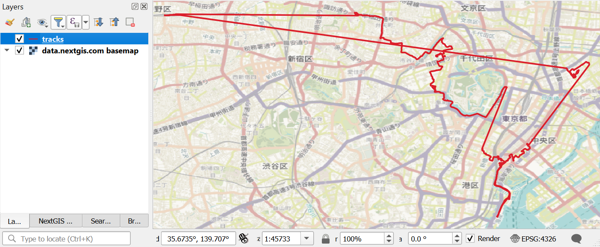

Merge GPX files
========================

Merge multiple GPS logs in GPX format to one. Most programms open tracks one by one. With this instrument you don't have to know in advance what day the information for a certain area was collected, all tracks will be viewed at once. 

   Multiple merged tracks in one layer in QGIS

Additionaly, This instrument fixes GPX files damaged by power down.

Input: 

* ZIP archive with GPX files. Subdirectories of several leverls are allowed. You can have files with the same name in different folders, the tool can process them anyway;
* Mode - select from the menu:

	* **Strict**: merge all content of GPX files using gpsbabel, may take long if there are many files. 
	* **Quick**: concat XML code as string, remove GPX extensions, quick, data is simplified.

.. important::
	Archives inside the archive are not supported. 

Output: 

* Merged GPX. Resulting GPX file with all tracks merged.
* Skipped files. List of skipped/invalid files (if any).

Launch instrument: https://toolbox.nextgis.com/t/gpxmerge

**Try it out using our sample:**

Download `input dataset <https://nextgis.com/data/toolbox/gpxmerge/gpxmerge_inputs.zip>`_ to test the instrument. Step-by-step instructions included.

Get the `output <https://nextgis.com/data/toolbox/gpxmerge/gpxmerge_outputs.zip>`_ to additionally check the results.

.. admonition:: Related tools

   * `Clip GPX file by bounding box <https://toolbox.nextgis.com/t/gpxclipbbox?from-related-tools=1>`_
   * `Split GPX file by days <https://toolbox.nextgis.com/t/gpxdailysplit?from-related-tools=1>`_
   * `Statistics of points and tracks in polygons from NGW <https://toolbox.nextgis.com/t/points_on_tracks_stats?from-related-tools=1>`_
