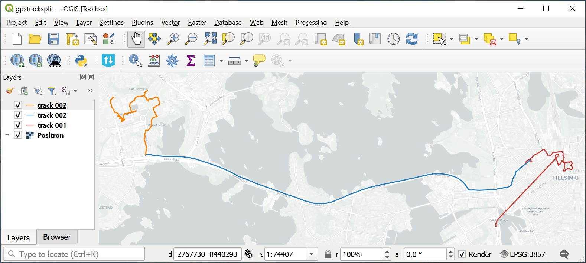

Split GPX into individual tracks
================================

Split a GPX file into separate GPX files with one track in each file

Inputs:

* One GPX file. You can merge multiple GPX fies into one using `Merge GPX Tracks <https://toolbox.nextgis.com/t/gpxmerge>`_ tool.

Outputs:

* ZIP-archive containing split GPX tracks.

Launch the tool: https://toolbox.nextgis.com/t/gpxtracksplit

Example:

.. todo:: _static/gpxtracksplit_input_en.png
   :name: gpxtracksplit_input_pic
   :align: center
   :width: 16cm

   Example input

   Example output: three individual tracks

**Try the tool in action by downloading our example:**

**Try the tool in action**

1. Click on the **Demo** button above the tool form. The fields are filled in with demo values.
2. Click on the **Run** button.

.. admonition:: Related tools

   * `Merge GPX Tracks <https://toolbox.nextgis.com/t/gpxmerge?from-related-tools=1>`_
   * `Split GPX file by days <https://toolbox.nextgis.com/t/gpxdailysplit?from-related-tools=1>`_
   * `Clip GPX file by bounding box <https://toolbox.nextgis.com/t/gpxclipbbox?from-related-tools=1>`_
   * `Geotag photos using GPX track <https://toolbox.nextgis.com/t/gpx2exif?from-related-tools=1>`_