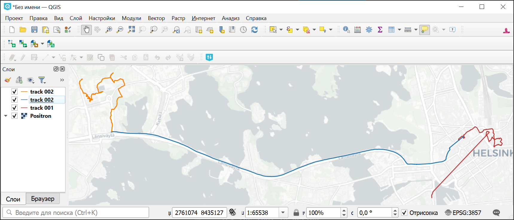

Разрезать GPX-файл на треки
===========================

Разделяет GPX-файл на отдельные файлы по трекам.

На входе:

* Исходный GPX-файл, который будет разрезаться по трекам. Если у вас много файлов, то сначала склейте их в один инструментом `Объединение треков GPX <https://toolbox.nextgis.com/t/gpxmerge>`_.

На выходе:

* ZIP-архив с отдельными GPX-файлами.

Запуск инструмента: https://toolbox.nextgis.com/t/gpxtracksplit

Пример работы инструмента:

.. figure:: _static/gpxtracksplit_input_ru.png
   :name: gpxtracksplit_input_pic
   :align: center
   :width: 16cm

   Пример исходных данных

   Пример результата работы инструмента

**Попробуйте инструмент в действии, скачав наш пример:**

1. Нажмите кнопку **Демо** над формой инструмента. Поля будут автоматически заполнены демонстрационными значениями.
2. Нажмите кнопку **Запустить**.

