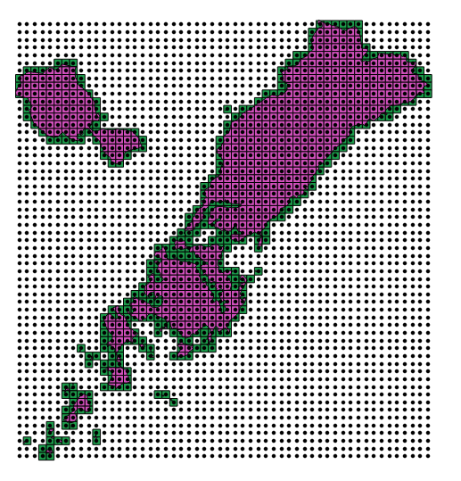
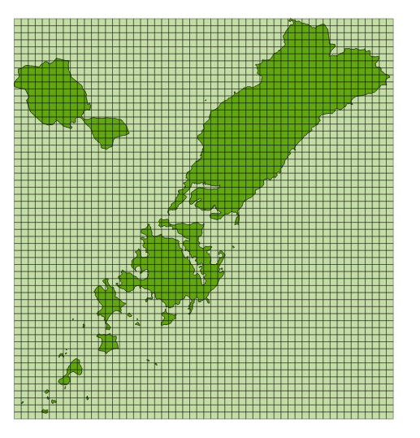
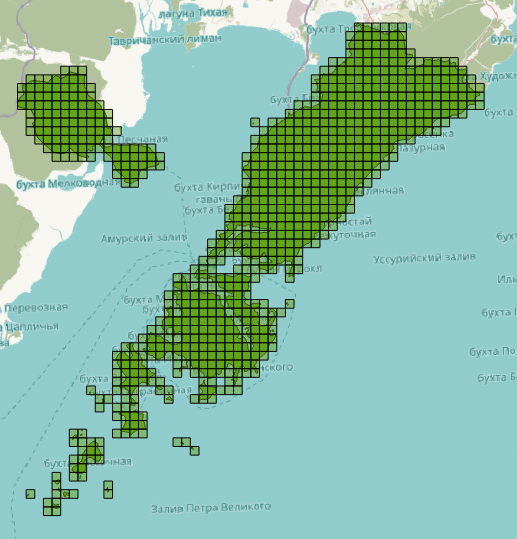
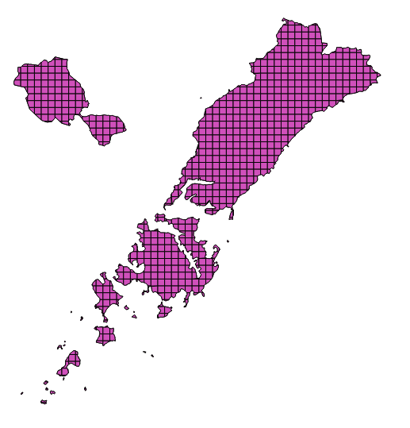
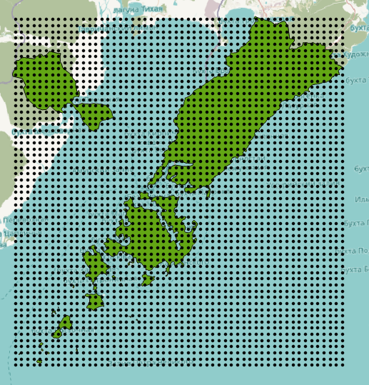
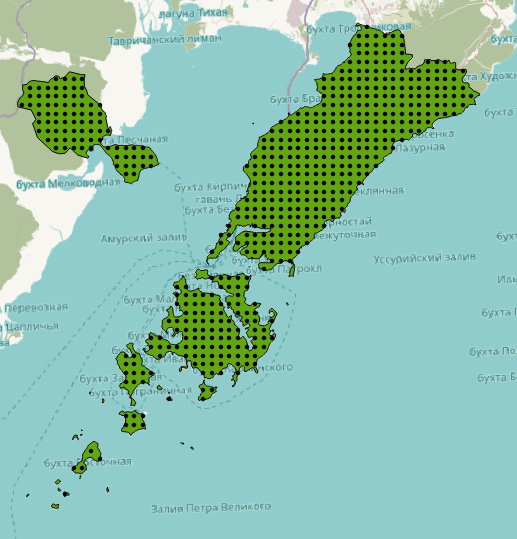

Генерация сетки в метрах
========================

   Сгенерированные сетки
   
Инструмент осуществляет генерацию сетки в границах объектов из векторного слоя. Размер сетки задаётся в метрах. Объекты могут быть в любом месте Эемли.

На входе:

*  Мультиполигональный слой с одним или несколькими объектами. Принимается формат Geopackage
*  Шаг сетки в метрах
*  Режим: points (точки), rect (квадраты).
*  Алгоритм обрезки сетки по границам: all (оставлять все квадраты в охвате объекта), touches (оставлять все квадраты касающиеся объекта), intersection (обрезать квадраты по границе объекта).

   all
   
   

   touches
   
   

   intersection
   
   

   all для точек
   
   

   touches и intersection для точек

   
.. figure:: _static/grid-planet.png
   :align: center
   :width: 16cm

   Сгенерированные сетки для нескольких полигонов в разных местах глобуса
   

На выходе:

* Geopackage

.. raw:: html

   <iframe width="720" height="405" src="https://rutube.ru/play/embed/a1d38a2a282c05facfe4b6edf69136fb/" frameBorder="0" allow="clipboard-write; autoplay" webkitAllowFullScreen mozallowfullscreen allowFullScreen></iframe>

Посмотреть видео на `youtube <https://youtu.be/v5WXJ7fhS9k>`_, `rutube <https://rutube.ru/video/a1d38a2a282c05facfe4b6edf69136fb/>`_.

Запуск инструмента: https://toolbox.nextgis.com/operation/grid

**Попробуйте инструмент в действии, скачав наш пример:**

`Набор исходных данных <https://nextgis.ru/data/toolbox/grid/grid_inputs_ru.zip>`_ для проверки работы инструмента. Внутри архива пошаговая инструкция.

`Пример результата <https://nextgis.ru/data/toolbox/grid/grid_outputs_ru.zip>`_ работы инструмента.
