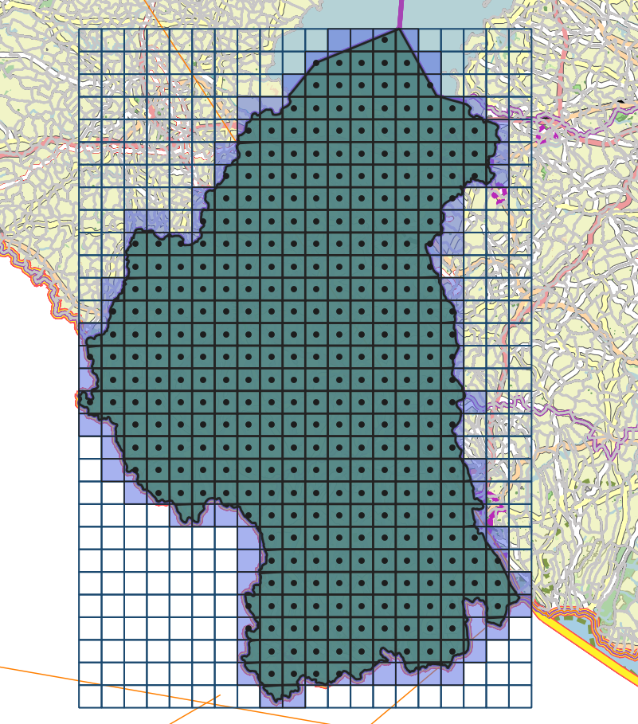
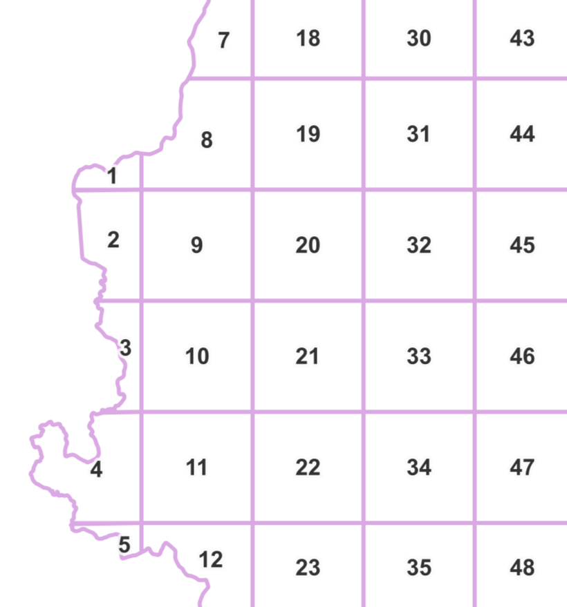
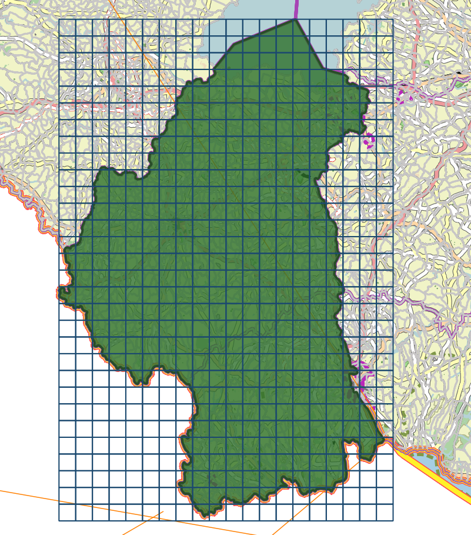
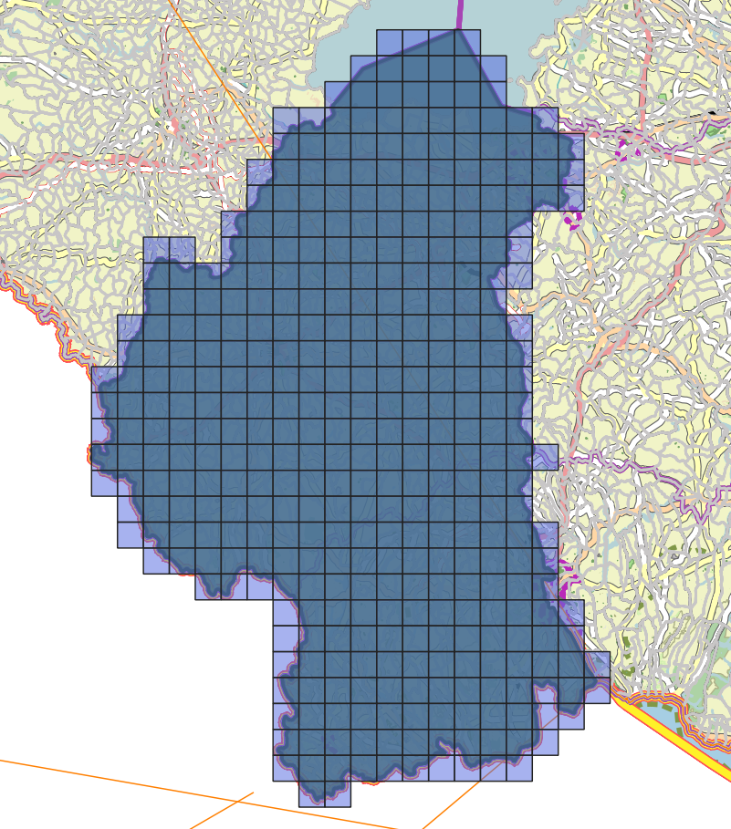
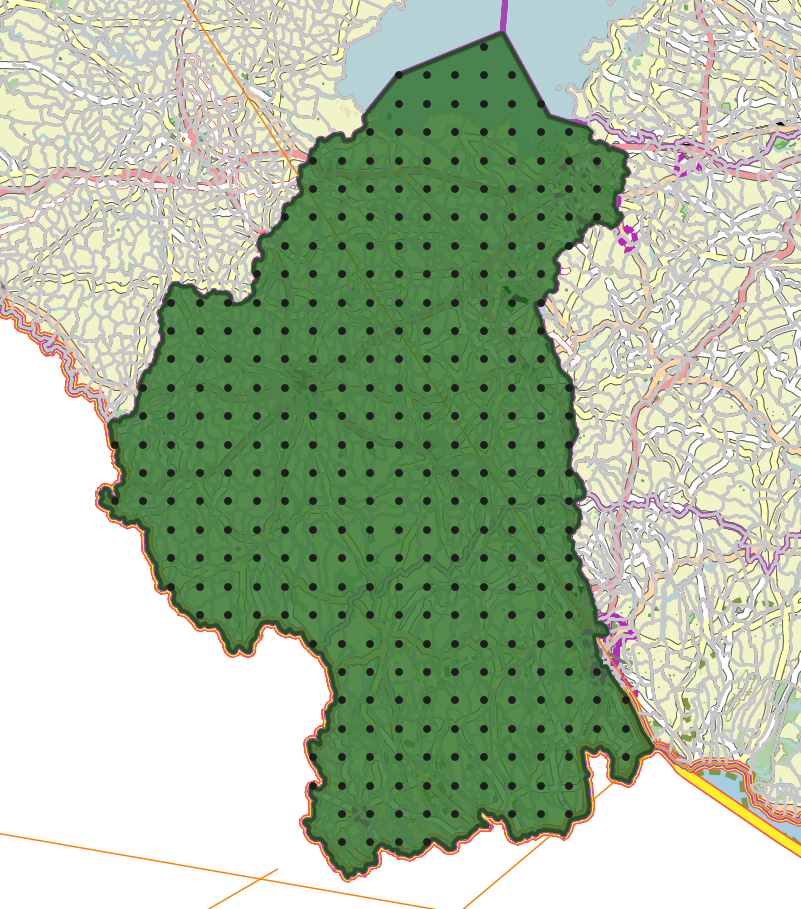
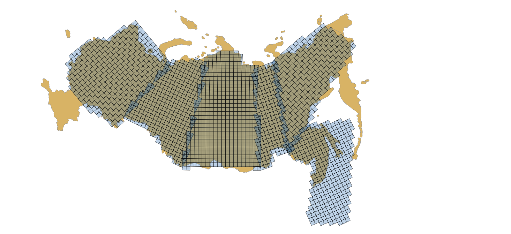

Генерация сетки в метрах
========================

   Сгенерированные сетки
   
Инструмент осуществляет генерацию сетки в границах объектов из векторного слоя или заданной на карте области. Размер сетки задаётся в метрах. Объекты могут быть в любом месте Земли.

На входе:

*  Шаг сетки в метрах
*  Режим: ``points`` (точки), ``rect`` (квадраты).
*  Алгоритм обрезки сетки по границам: ``all`` (оставлять все квадраты в охвате объекта), ``touches`` (оставлять все квадраты, касающиеся объекта), ``intersection`` (обрезать квадраты по границе объекта).
* Векторный файл границы в формате Geopackage, содержащий полигоны или мультиполигоны. Время расчёта зависит от количества узлов в слое границ. 
* Охват. Вместо загрузки файла границ можно задать охват. Для этого нарисуйте произвольный прямоугольник на карте ниже. В поле охвата отобразится цифровое значение, которое также можно откорректировать.
* Вертикально или с точной площадью. По умолчанию ``simple`` - сетка получается верткальной в стандартной проекции WGS 84 Мерактор (EPSG:3857), использующей градусы, но может быть искажение в размерах и углах. Введите ``fine``, если важно, чтобы размеры и площадь сохранялись (но сетка будет повёрнута).

На выходе:

* Файл GeoPackage с сеткой выбранного вида. Каждая ячейка сетки имеет атрибуты number (номер ячейки - ячейки нумеруются по вертикали сверху вниз, слева направо, начиная с самого левого столбца ячеек, даже если он не доходит до верха), row_index (номер ряда) и col_index (номер столбца). Чтобы отобразить подписи ячеек, включите подписи в свойствах стиля и выберите нужный атрибут.

   Начало нумерации ячеек

Результат работы инструмента при разных настройках:

   Квадраты - all
   
   

   Квадраты - touches
   
   

   Квадраты - intersection
   
   

   Точки - all
   
   

   Точки - intersection

.. todo:: _static/grid_point_touches.png
   :align: center
   :name: grid_point_touches_pic
   :width: 10cm

   Точки - touches

   Сгенерированные сетки для нескольких полигонов в разных местах глобуса
   

На выходе:

* GeoPackage с выбранной геометрией: точки или полигоны

.. raw:: html

   <iframe width="720" height="405" src="https://rutube.ru/play/embed/a1d38a2a282c05facfe4b6edf69136fb/" frameBorder="0" allow="clipboard-write; autoplay" webkitAllowFullScreen mozallowfullscreen allowFullScreen></iframe>

Посмотреть видео на `youtube <https://youtu.be/v5WXJ7fhS9k>`_, `rutube <https://rutube.ru/video/a1d38a2a282c05facfe4b6edf69136fb/>`_.

Запуск инструмента: https://toolbox.nextgis.com/operation/grid

**Попробуйте инструмент в действии, скачав наш пример:**

`Набор исходных данных <https://nextgis.ru/data/toolbox/grid/grid_inputs_ru.zip>`_ для проверки работы инструмента. Внутри архива пошаговая инструкция.

`Пример результата <https://nextgis.ru/data/toolbox/grid/grid_outputs_ru.zip>`_ работы инструмента.
