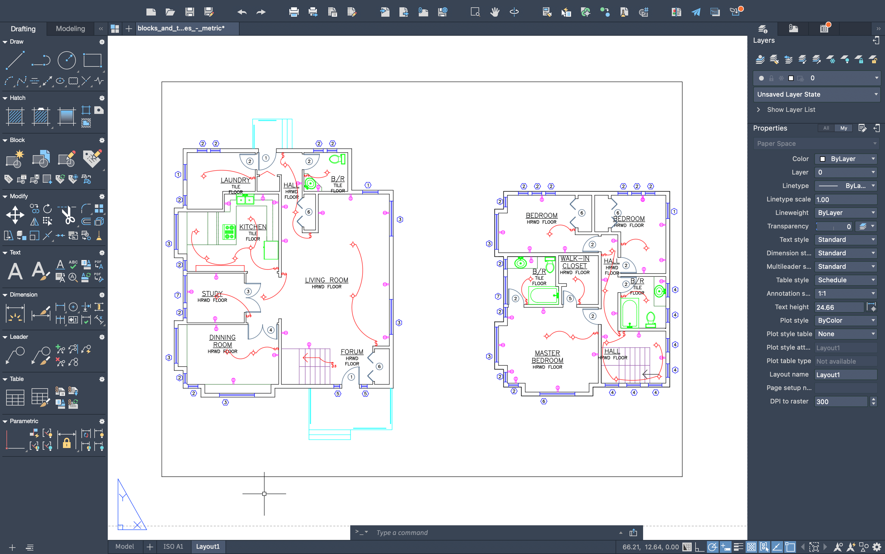
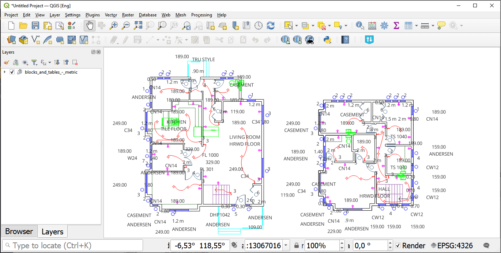

DWG to DXF (ODA)
================

Converts DWG file into DXF using ODA File Converter

Inputs:

* Source DWG. Source file in AutoCAD DWG format

Outputs:

* DXF file

Launch the tool: https://toolbox.nextgis.com/t/import_dwg_oda

Example:

   Example input

   Converted file opened in QGIS

**Try the tool in action**

1. Click on the **Demo** button above the tool form. The fields are filled in with demo values.
2. Click on the **Run** button.

.. admonition:: Related tools

   * `DWG to DXF <https://toolbox.nextgis.com/t/import_dwg?from-related-tools=1>`_
   * `Layer list from DWG / DXF file <https://toolbox.nextgis.com/t/autocad_file_schema?from-related-tools=1>`_