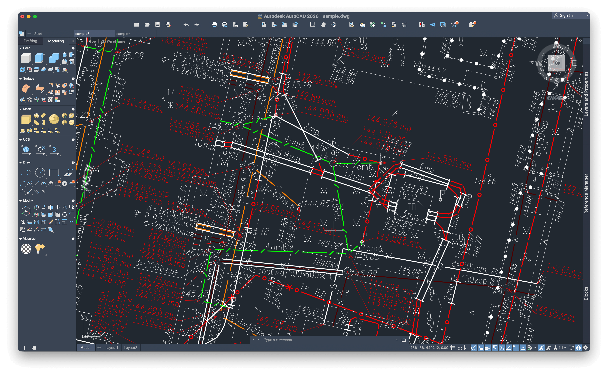
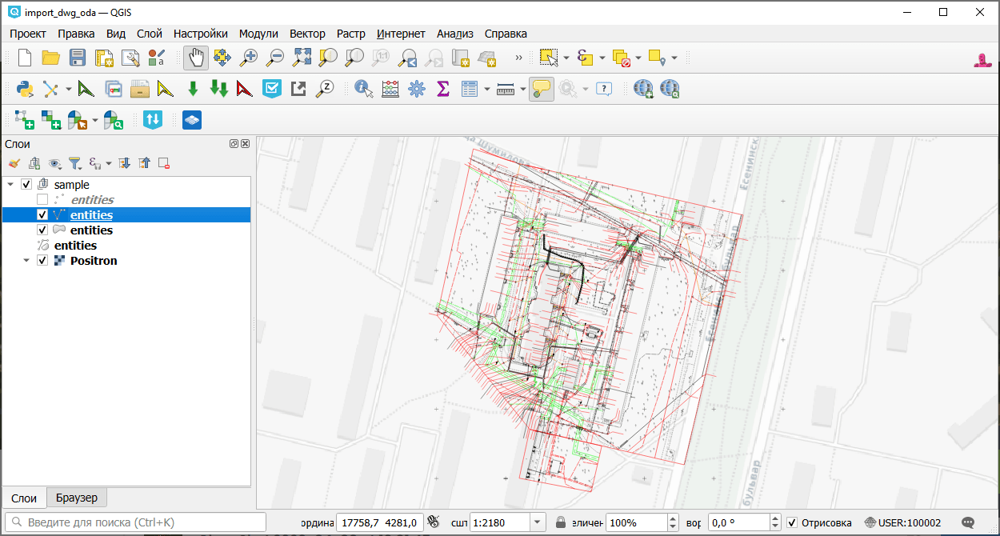

DWG в DXF (ODA)
===============

Конвертирует файл DWG в DXF с использованием ODA File Converter.

На входе:

* Исходный файл в формате AutoCAD DWG

На выходе:

* Файл в формате DXF

Обратите внимание: чтобы файл корректно открылся в QGIS, нужно `добавить соответствующую систему координат <https://docs.nextgis.ru/docs_ngqgis/source/srs.html#ngq-custom-projections>`_.

Запуск инструмента: https://toolbox.nextgis.com/t/import_dwg_oda

Пример работы инструмента:

   Исходный чертёж в AutoCAD

   Полученный файл DXF открыт в NextGIS QGIS

**Попробуйте инструмент в действии:**

1. Нажмите кнопку **Демо** над формой инструмента. Поля будут автоматически заполнены демонстрационными значениями.
2. Нажмите кнопку **Запустить**.

.. seealso::

   * `DWG в DXF <https://toolbox.nextgis.com/t/import_dwg?from-related-tools=1>`_
   * `Список слоёв файла DWG / DXF <https://toolbox.nextgis.com/t/autocad_file_schema?from-related-tools=1>`_