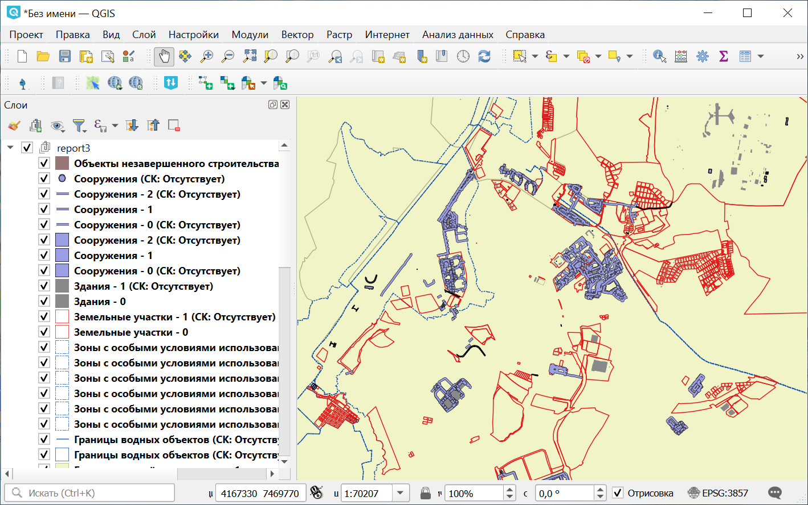

Конвертация данных ЕГРН
=======================

Конвертация выписок ЕГРН в геоданные. `Поддерживаемые форматы данных ЕГРН <https://docs.nextgis.ru/docs_rosreestr_tools/source/rr-import.html#ngq-rr-import-supported>`_.

   Результирующие данные

На входе:

*  Исходный набор данных ``Обязательное поле`` - XML-документ с выпиской или ZIP-архив с набором выписок. Поддерживаются вложенные архивы. Максимальный размер XML-файла или совокупности нескольких файлов - 100 мб. Если необходимо конвертировать больший по размеру файл, пожалуйста, воспользуйтесь модулем `NGQ Rosreestr Tools <https://docs.nextgis.ru/docs_rosreestr_tools/source/toc.html>`_ в настольной программе NextGIS QGIS.
* СК данных - можно добавить строку proj4, WKT или код EPSG системы координат. Если оставить поле пустым будет применен автоподбор системы координат.
*  Формат выходных данных - GPKG, GeoJSON, ESRI Shapefile или MapInfo File. Если оставить поле пустым, используется GPKG.
* Имя выходного файла - Название выходного архива и имя выходного файла при выборе формата GPKG, при выборе прочих форматов - префикс. Для кириллических символов применяется транслитерация. Если оставить пустым, в качестве имени используется название инструмента - import_egrn
* Целевая СК - можно добавить строку proj4, WKT или код EPSG системы координат. Если оставить поле пустым, данные будут записаны в системе координат, указанной в поле "СК данных". Если оба поля пустые, будет использована автоматически определённая система координат.
*  Объединять наборы данных - При конвертации нескольких файлов XML слои из разных файлов, но с одинаковым типом объектов будут объединены в один общий слой (исходные результаты конвертации также сохранятся). Не рекомендуется использовать с форматом MapInfo File.
* Объединять нераспознанные СК - при выборе этой опции слои одного типа объектов с нераспознанными СК (в случае автоподбора) будут объединены в один слой.
*  Пропускать объекты без геометрии - Игнорировать записи в XML-документах, для которых отсутствуют геометрии (координаты).
*  Удалять пустые атрибуты - Атрибуты, не содержащие информацию ни по одному объекту, будут целиком удалены из слоя.
*  Конвертировать доп. данные - Иногда к выпискам присоединен отдельный раздел ReestrExtract, в котором содержится дополнительная информация. Например, о правах собственности на объекты. Если опция включена, эти данные будут добавлены в отдельные слои без геометрий.

На выходе:

* ZIP архив с результатами конвертации. 

.. raw:: html

   <iframe width="720" height="405" src="https://rutube.ru/play/embed/5255ec9b95e6f34d0e5d4ceb8fb20f82/" frameBorder="0" allow="clipboard-write; autoplay" webkitAllowFullScreen mozallowfullscreen allowFullScreen></iframe>

Посмотреть видео на `youtube <https://youtu.be/UbrepJSZpUQ>`_, `rutube <https://rutube.ru/video/5255ec9b95e6f34d0e5d4ceb8fb20f82/>`_.

Запуск инструмента: https://toolbox.nextgis.com/t/import_egrn

**Попробуйте инструмент в действии, скачав наш пример:**

`Набор исходных данных <https://nextgis.ru/data/toolbox/import_egrn/import_egrn_inputs_ru.zip>`_ для проверки работы инструмента. Внутри архива пошаговая инструкция.

`Пример результата <https://nextgis.ru/data/toolbox/import_egrn/import_egrn_outputs_ru.zip>`_ работы инструмента.

.. seealso::

   * `Получить геометрию участка по кадастровому номеру <https://toolbox.nextgis.com/t/rosreestr2coord>`_
   * `Дежурная кадастровая карта <https://toolbox.nextgis.com/t/dezhurcad>`_
   * `Список КПТ по заданной области <https://toolbox.nextgis.com/t/egrn_kvartals_cover>`_
   * `DWG в DXF <https://toolbox.nextgis.com/t/import_dwg>`_
   * Для конвертации и других операций с кадастровыми данными вы также можете использовать `конвертер Rosreestr Tools <https://docs.nextgis.ru/docs_rosreestr_tools/source/rr-import.html#>`_.
