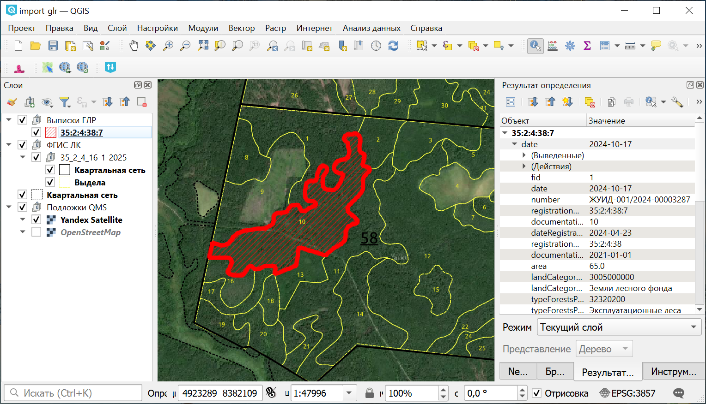

Конвертация выписок ГЛР 
===========================

Инструмент позволяет конвертировать выписки Государственного лесного реестра из формата XML в наборы геоданных.

Поддерживаемые типы выписок:

* выписка на лесной квартал (stateForestRegisterExtractForestQuarter)
* выписка на лесотаксационный выдел (stateForestRegisterExtractForestTaxingAllocation)
* выписка на лесничество (stateForestRegisterExtractForestry)
* выписка на участковое лесничество (stateForestRegisterExtractPartForestry)
* выписка на лесной участок (stateForestRegisterExtractForestPart)
* выписка на лесосеку (stateForestRegisterExtractCuttingArea)

На входе:

* Исходный набор данных - Один файл выписки в формате XML или архив, содержащий выписки в формате XML;
* Добавить слой вершин - опция, при включении которой дополнительно к слою полигонов будет создан точечный слой вершин с каталогом координат в атрибутивной таблице.

На выходе:

* Файл GPKG

Исходный файл выписки может содержать данные **в разных системах координат**. 

* Если данные в EPSG:4326, при открытии файла в QGIS система координат будет определена автоматически. 
* Если исходные данные в другой системе координат, инструмент подбирает СК на основе значения в XML. Если значение не известно - слой будет записан без СК. В этом случае (а также при ошибочном определении СК) нужно будет выбрать систему координат вручную.
* Если система координат отсутствует в каталоге QGIS (например, МСК), её нужно сначала `добавить <https://docs.nextgis.ru/docs_ngqgis/source/srs.html#ngq-custom-projections>`_.

Информация о системе координат вынесена в название слоя, также присутствует в атрибутах.

Если в исходных данных есть дополнительные тэги, они собираются в таблицу без геометрии внутри файла GeoPackage.

   Геоданные, полученные с помощью инструмента, в проекте QGIS

Запуск инструмента: https://toolbox.nextgis.com/t/import_glr

**Попробуйте инструмент в действии, скачав наш пример:**

`Набор исходных данных <https://nextgis.ru/data/toolbox/import_glr/import_glr_inputs_ru.zip>`_ для проверки работы инструмента. Внутри архива пошаговая инструкция.

`Пример результата <https://nextgis.ru/data/toolbox/import_glr/import_glr_outputs_ru.zip>`_ работы инструмента.

.. seealso::

   * `Каталог учетных номеров <https://toolbox.nextgis.com/t/plk_catalog?from-related-tools=1>`_
   * `Получить геометрию участка по кадастровому номеру <https://toolbox.nextgis.com/t/rosreestr2coord?from-related-tools=1>`_
   * `Конвертация данных ЕГРН <https://toolbox.nextgis.com/t/import_egrn?from-related-tools=1>`_
   * `Конвертация XML: Лесная декларация <https://toolbox.nextgis.com/t/xml_decl_to_vector?from-related-tools=1>`_