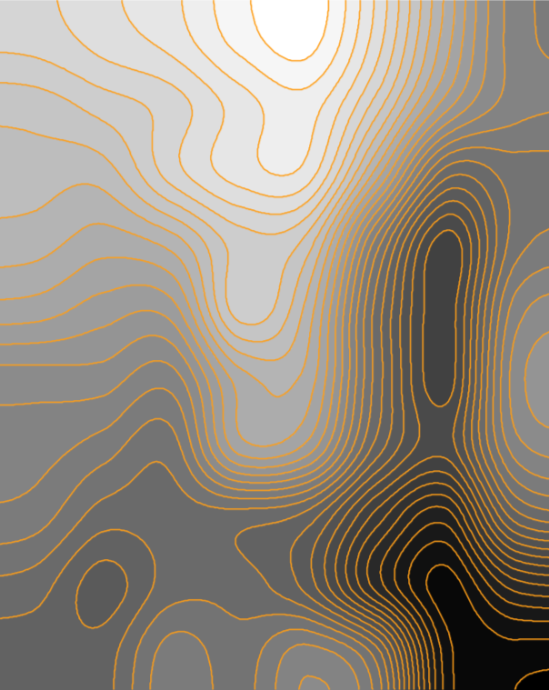

Improve DEM
===============

Improves Digital Elevation Model, makes the resulting contour lines smoother and simpler.

Input, all fields are required:

* **Raster file** - DEM file in TIFF format downloaded from NextGIS Data;
* **Interpolation method** used to enhance the DEM file. Available methods: ``nearest, bilinear, cubic, cubicspline, lanczos, average, rms, mode``;
* **Interval between contours** - Vertical step of the contour lines in meters;
* **Simplification step** for the contour lines. Integer (for example, 2), decimal separated by a dot (for example, 0.02) or exponential notation (for example, 2e-2)
* **Refinement, %** - Improvement of the DEM file resolution, in percents. Shows how much the pixel size should increase/decrease. For example, a value of 1000 % will result in 10 times smaller pixels

Output:

* TIFF file of the refined DEM;
* GeoPackage file of the contour lines.

   Input raster

   Processed raster and contours generated from it

Launch the tool: https://toolbox.nextgis.com/t/improvedem

**Try it out using our sample:**

Download `input dataset <https://nextgis.com/data/toolbox/improvedem/improvedem_inputs.zip>`_ to test the instrument. Step-by-step instructions included.

Get the `output <https://nextgis.com/data/toolbox/improvedem/improvedem_outputs.zip>`_ to additionally check the results.
