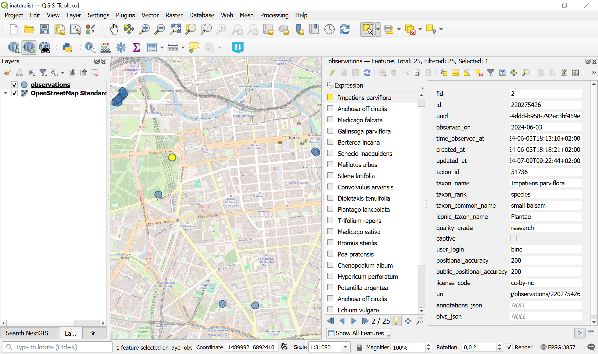

iNaturalist species observations to geodata
===========================================

Launch the tool: https://toolbox.nextgis.com/t/inaturalist_download

Downloads species observations from the public iNaturalist API for a given bounding box, optionally filtered by taxon (scientific name), iconic group, quality grade, wildness and observation date. Hard limit: 10 000 records per run.

Inputs:

* Bounding box - draw your area of interest on the map or enter coordinates in decimal degrees (West, South, East, North in WGS84).
* Taxon name - ccientific or common taxon name (e.g. ``Bubo bubo`` or ``Eagle-owl``). Leave empty to download all species in the area.
* Iconic taxon group. Select one iconic taxon group (Birds, Plants, Insects, Fungi, Mammals, etc). Combines with 'Taxon name' if both are set. Options:

    - Animalia
    - Actinopterygii
    - Amphibia
    - Arachnida
    - Aves
    - Chromista
    - Fungi
    - Insecta
    - Mammalia
    - Mollusca
    - Plantae
    - Protozoa
    - Reptilia

* Observation quality. iNaturalist quality grade filter. Options:

    - Research Grade (research)
    - Needs ID (needs_id)
    - Casual (casual)

* Only wild. Exclude captive / cultivated observations. Default: all observation types.
* Observation date from. Lower bound of observation date. Format: YYYY-MM-DD.
* Observation date to. Upper bound of observation date. Format: YYYY-MM-DD.

Outputs:

* GeoPackage with one point layer 'observations';
* Report;
* JSON.

Example:

   Example output file opened in QGIS

**Try the tool in action**

1. Click on the **Demo** button above the tool form. The fields are filled in with demo values.
2. Click on the **Run** button.

.. seealso::

   * `GBIF species observations to geodata <https://toolbox.nextgis.com/t/gbif_download?from-related-tools=1>`_
   * `Download Sentinel-2 and Landsat-C2L2 satellite data <https://toolbox.nextgis.com/t/download_and_prepare_l8_s2?from-related-tools=1>`_
   * `KML to geodata <https://toolbox.nextgis.com/t/kml2geodata?from-related-tools=1>`_
