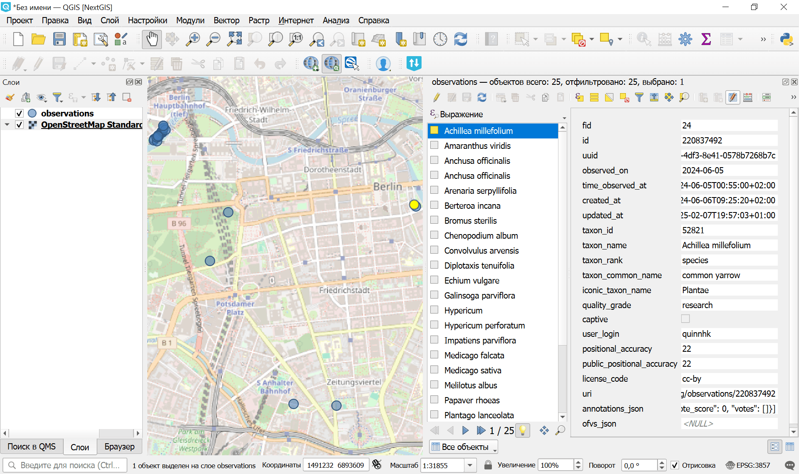

Наблюдения видов iNaturalist в геоданные
========================================

Запуск инструмента: https://toolbox.nextgis.com/t/inaturalist_download

Загрузка наблюдений видов из публичного API iNaturalist для заданной области, с опциональной фильтрацией по таксону (научное название), iconic-группе, качеству, дикости и дате наблюдения. Жёсткое ограничение: 10 000 записей за запуск.

На входе:

* Ограничивающий прямоугольник - нарисуйте на карте или введите вручную координаты рамки области интереса (запад, юг, восток, север в WGS84).
* Название таксона - научное или обиходное название таксона (например 'Bubo bubo'). Разрешается через /taxa/autocomplete в идентификатор таксона; включаются все потомки. Оставьте пустым, чтобы загрузить все виды.
* Iconic-группа. Ограничить одной iconic-группой (птицы, растения, насекомые, грибы, млекопитающие, …). Комбинируется с 'Название таксона'. Варианты:

    - Animalia
    - Actinopterygii
    - Amphibia
    - Arachnida
    - Aves
    - Chromista
    - Fungi
    - Insecta
    - Mammalia
    - Mollusca
    - Plantae
    - Protozoa
    - Reptilia

* Качество записи. Фильтр по качеству записи iNaturalist. По умолчанию: Research Grade. Возможные варианты:

    - Research Grade (research)
    - Needs ID (needs_id)
    - Casual (casual)

* Только дикие - исключить наблюдения в неволе/культуре. По умолчанию отключено.
* Дата наблюдения от - нижняя граница даты наблюдения (ISO 8601, ГГГГ-ММ-ДД).
* Дата наблюдения до - верхняя граница даты наблюдения (ISO 8601, ГГГГ-ММ-ДД).

На выходе:

* GeoPackage со слоем точек 'observations';
* Отчёт о работе инструмента;
* Вывод JSON.

Пример работы инструмента:

   Пример результата работы инструмента открыт в NextGIS QGIS

**Попробуйте инструмент в действии:**

1. Нажмите кнопку **Демо** над формой инструмента. Поля будут автоматически заполнены демонстрационными значениями.
2. Нажмите кнопку **Запустить**.

