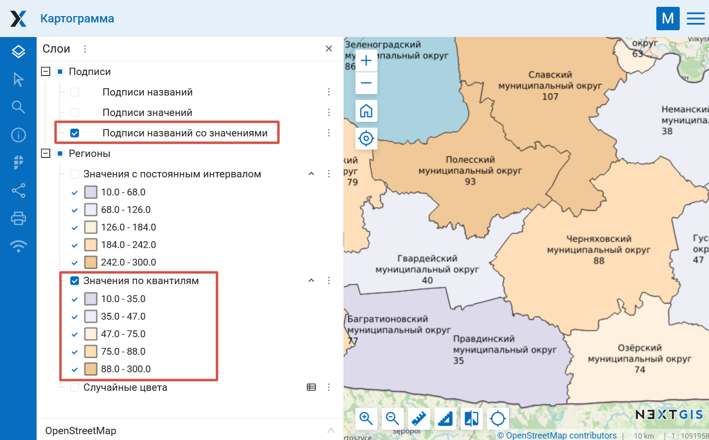

Раскрасить карту по показателям
===============================

Инструмент помогает создать инфографику на основе таблицы с кодами регионов ОКАТО и числовыми значениями. В Веб ГИС создаётся картограмма - карта, где каждый регион окрашен своим цветом в зависимости от указанного значения. Можно настроить распределение цветов и подписи.

На входе:

* Адрес Веб ГИС. Полный адрес Веб ГИС, например: https://sandbox.nextgis.com;
* Логин. NextGIS ID или имя пользователя, имеющего права на запись в соответствующие ресурсы;
* Пароль. Пароль пользователя Веб ГИС;
* Идентификатор группы- в ней будет создана подгруппа, в которой будут находиться векторные слои и веб-карта. Номер ресурса группы в Веб ГИС - число, которым заканчивается адрес папки в строке браузера. Для Основной группы ресурсов ID=0;
* Язык условных обозначений. Введите ``RU``, чтобы получить текст на русском. Чтобы получить текст на английском, впишите ``EN`` или оставьте пустым;
* Название вашей карты. Произвольный текст. Это название будет написано в углу экрана на карте;
* URL таблицы Google/Yandex. Ссылка на таблицу в Google Sheets/Yandex Disk. Вместо ссылки можно указать идентификатор таблицы. В документе должен быть атрибут **okato** или **oktmo**, и ваш атрибут - числа или тексты. Сейчас инструмент работает только с российскими классификаторами ОКАТО и ОКТМО. Если будет атрибут NAME, то на карте будут названия.
* Архив с выгрузкой региона с data.nextgis.com, в GeoPackage, GeoJSON, ESRI Shapefile. 

На выходе:

* Веб-карта в указанной Веб ГИС, содержащая слой полигонов и слой подписей и варианты их стилизации, которые можно комбинировать между собой.

Для полигонов создаются следующие стили:

* Случайные цвета - каждому значению параметра соответствует свой оттенок;
* Значения с постоянным интервалом - диапазон указанных в таблице значений делится на несколько отрезков, каждому из них присваивается свой цвет дискретного градиента;
* Значения по квантилям.

Для подписей можно выбрать один из следующих вариантов:

* Без подписей;
* Подписи названий со значениями;
* Только названия;
* Только значения.

Запуск инструмента: https://toolbox.nextgis.com/t/infomap

   Фрагмент полученной картограммы

**Попробуйте инструмент в действии, скачав наш пример:**

`Набор исходных данных <https://nextgis.ru/data/toolbox/infomap/infomap_inputs_ru.zip>`_ для проверки работы инструмента. Внутри архива пошаговая инструкция.

`Пример результата <https://nextgis.ru/data/toolbox/infomap/infomap_outputs_ru.zip>`_ работы инструмента.

.. seealso::

   * `Таблица в векторный файл <https://toolbox.nextgis.com/t/table2geo>`_
   * `Таблица Google/Яндекс в Веб ГИС <https://toolbox.nextgis.com/t/spreadsheet2layer>`_
   * `Добавление названий АТД и НП в атрибуты <https://toolbox.nextgis.com/t/add_regions>`_