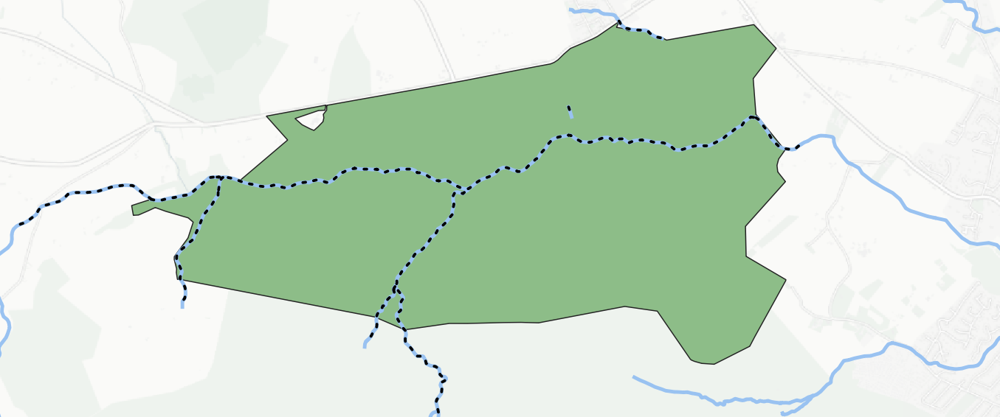

Intersection registry
================

The tool intersects a polygonal layer with another vector layer (any type of geometry) and outputs the result as a set of CSV files.

Inputs:

* Shapefile with a layer to intersect. ESRI Shapefile (ZIP-archive) with any type of geometries. Objects from this layer are meant to be intersected with the objects from the polygonal layer
* Shapefile with a polygonal layer. ESRI Shapefile (ZIP-archive) with a polygonal layer. Intersection status with another layer will be traced for each object from this layer
* Field name for CSV files. Field name from the polygonal layer. Values from this field will be used to name CSV files. If this field is blank, CSV file names will be generated automatically.

Outputs:

*  Zipped CSV files, each of which describes one of the objects of the polygonal layer. If an object from a polygon layer has an intersection with an object from another layer, the CSV file will contain the coordinates of the center and the WKT description of the polygon.

Launch the tool: https://toolbox.nextgis.com/t/intersect_layers

   Parts of hydrography intersecting with the park are marked by dotted lines

**Try the tool in action**

1. Click on the **Demo** button above the tool form. The fields are filled in with demo values.
2. Click on the **Run** button.

.. admonition:: Related tools

   * `Intersector <https://toolbox.nextgis.com/t/ngw_intersect?from-related-tools=1>`_
   * `Polygon intersection <https://toolbox.nextgis.com/t/vectorclip?from-related-tools=1>`_
   * `Erase overlapping areas from layer <https://toolbox.nextgis.com/t/eraser?from-related-tools=1>`_