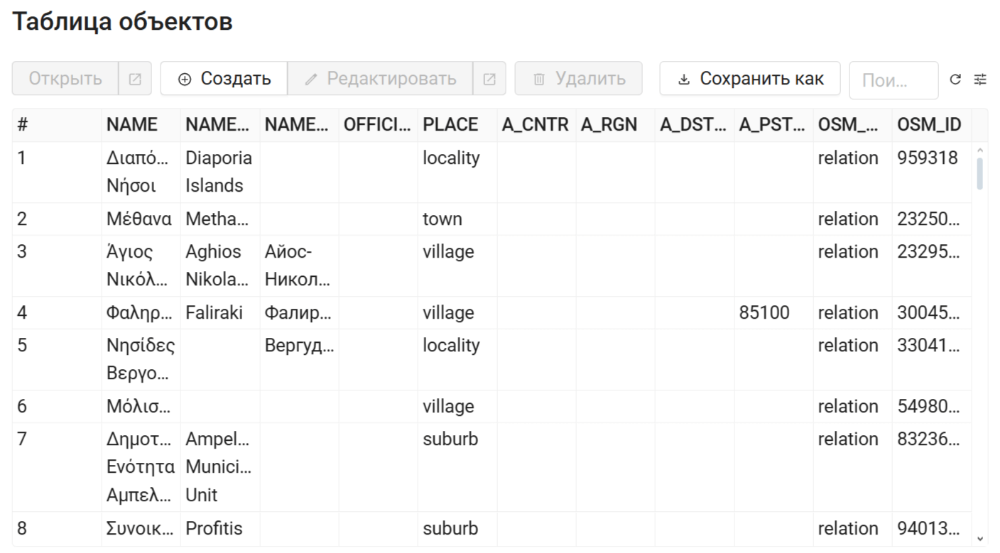
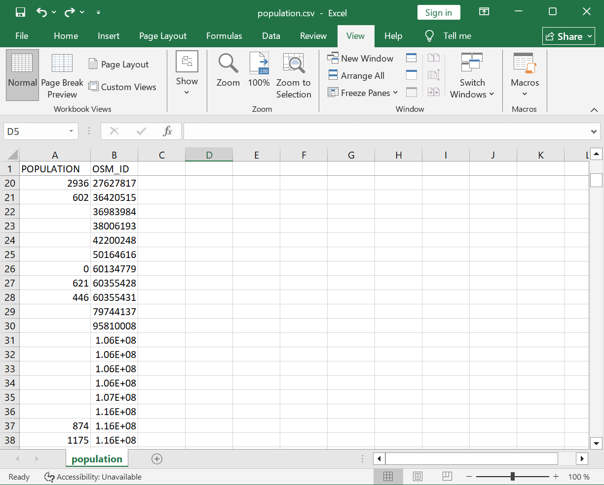
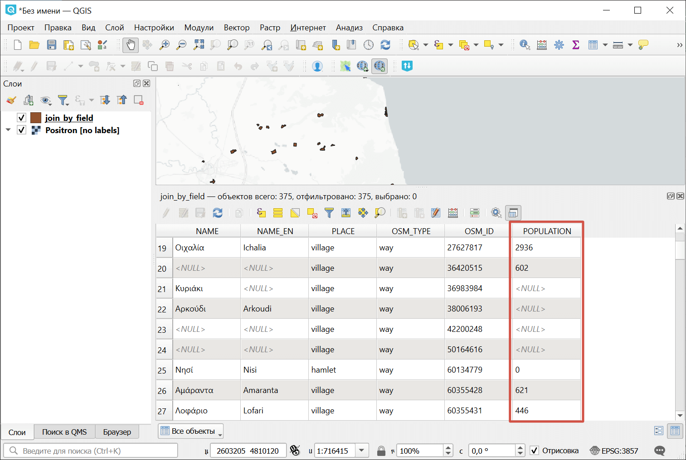

Объединение слоя и таблицы по полю
==================================

Инструмент объединяет данные из таблицы и слоя по заданному полю. Инструмент предполагает использование двух разных режимов объединения: one-to-one - находит первый по порядку элемент таблицы и присоединяет его атрибуты; one-to-many - присоединяет все элементы таблицы, для которых совпадает заданное поле, при этом геометрия пространственного объекта дублируется для каждого элемента.

На входе:

* Адрес Веб ГИС - адрес используемой Веб ГИС на платформе NextGIS Web в формате ``https://example.nextgis.com``;
* ID ресурса - цифры в конце ссылки на слой с данными из используемой Веб ГИС;
* CSV файл для присоединения - таблица для присоединения в формате CSV;
* Поле в слое Веб ГИС - название поля в слое Веб ГИС, по которому будет выполняться присоединение;
* Ключ в CSV - название столбца в таблице, по которому будет выполняться присоединение;
* Вид присоединения: 

    - Один ко многим (0)
    - Один к одному (1).

На выходе:

*  Слой в формате ESRI Shapefile, запакованный в ZIP-архив

Запуск инструмента: https://toolbox.nextgis.com/t/join_by_field

Пример использования:

   Таблица объектов исходного слоя

   Таблица в CSV

   Пример результата работы инструмента

**Попробуйте инструмент в действии, скачав наш пример:**

`Набор исходных данных <https://nextgis.ru/data/toolbox/join_by_field/join_by_field_inputs_ru.zip>`_ для проверки работы инструмента. Внутри архива пошаговая инструкция.

`Пример результата <https://nextgis.ru/data/toolbox/join_by_field/join_by_field_outputs_ru.zip>`_ работы инструмента.

.. seealso::

   * `Обновление слоя Веб ГИС из CSV <https://toolbox.nextgis.com/t/update_vector_layer?from-related-tools=1>`_