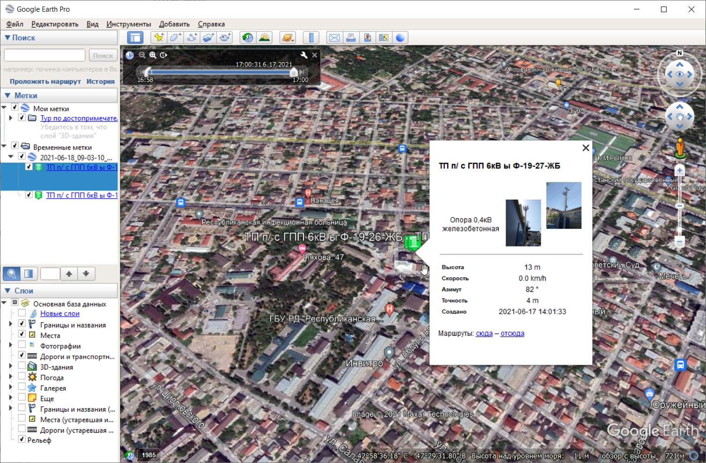
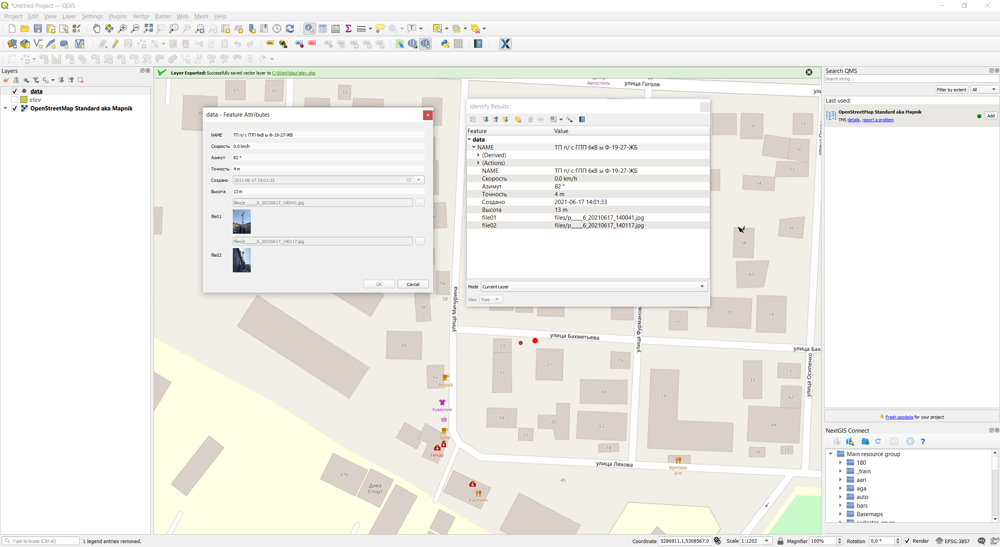

KML в геоданные
===============

Конвертирование KML, KMZ в структурированные геоданные (GeoJSON). Инструмент умеет работать с приложениями (фото) и умеет разбирать таблицы структурированных данных, записанных в описание (description) объекта.

На входе:

* Исходные данные - файл в формате KML или KMZ.
* Поля таблицы - опциональное поле. При необходимости укажите через запятую и без пробелов поля таблицы из раздела description файла KML, которые надо обработать.
* Проверять наличие файлов - если отмечено, то в результирующем GeoJSON будут упомянуты только файлы, действительно присутствующие во входном архиве (так как исходный KML может содержать информацию о дополнительных файлах, часть которых может отсуствовать в архиве).
* Игнорировать расширенные данные - если отмечено, то будет игнорироваться содержимое lc:attachment.
* Сохранить координату Z - если отмечено, будет сохранена координата Z и созданы геометрии типа PointZ/LinestringZ и т.д.

На выходе:

* Файл ZIP со слоем GeoJSON и приложениями, если они есть.

.. raw:: html

   <iframe width="720" height="405" src="https://rutube.ru/play/embed/efdde3953825f0b071f93b35f67103df/" frameBorder="0" allow="clipboard-write; autoplay" webkitAllowFullScreen mozallowfullscreen allowFullScreen></iframe>

Посмотреть видео на `youtube <https://youtu.be/Qggg-0qqOs4>`_, `rutube <https://rutube.ru/video/efdde3953825f0b071f93b35f67103df/>`_.

Запуск инструмента: https://toolbox.nextgis.com/t/kml2geodata

   
   Пример исходных данных. KML c атрибутами записанными в описание объекта в Google Earth

   
   Пример результата работы инструмента. Загруженные в QGIS геоданные

**Попробуйте инструмент в действии, скачав наш пример:**

`Набор исходных данных <https://nextgis.ru/data/toolbox/kml2geodata/kml2geodata_inputs_ru.zip>`_ для проверки работы инструмента. Внутри архива пошаговая инструкция.

`Пример результата <https://nextgis.ru/data/toolbox/kml2geodata/kml2geodata_outputs_ru.zip>`_ работы инструмента.

.. seealso::

   * `Конвертация векторных слоев <https://toolbox.nextgis.com/t/convert?from-related-tools=1>`_
   * `Конвертация MapInfo для QGIS <https://toolbox.nextgis.com/t/mapinfo2qgis?from-related-tools=1>`_
   * `DWG в DXF <https://toolbox.nextgis.com/t/import_dwg?from-related-tools=1>`_
