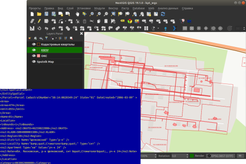

Convert EGRN KPT to geodata
===========================

   Initial and resulting data
   
The tool converts one or several Rosreestr KPT from XML format into a convenient geodata format with a GIS project.

Inputs:

*  Zip archive with zip archives of Rosreestr downloads (archive of archives with the name format Response-80-105152635.zip)
*  Output geodata format - GeoJSON, ESRI Shape, MapInfo TAB

Outputs:

* zip archive with the QGIS project and geodata

The archive contains directories: a geodata directory in the original coordinate system, a geodata directory in EPSG: 4326 (wgs) and a project for QGIS with data in EPSG: 4326 with the design.

A description of the layers is given at https://data.nextgis.com/en/cadastre/#region-layers

Launch the tool: https://toolbox.nextgis.com/t/pkk_kpt

**Try the tool in action**

1. Click on the **Demo** button above the tool form. The fields are filled in with demo values.
2. Click on the **Run** button.
