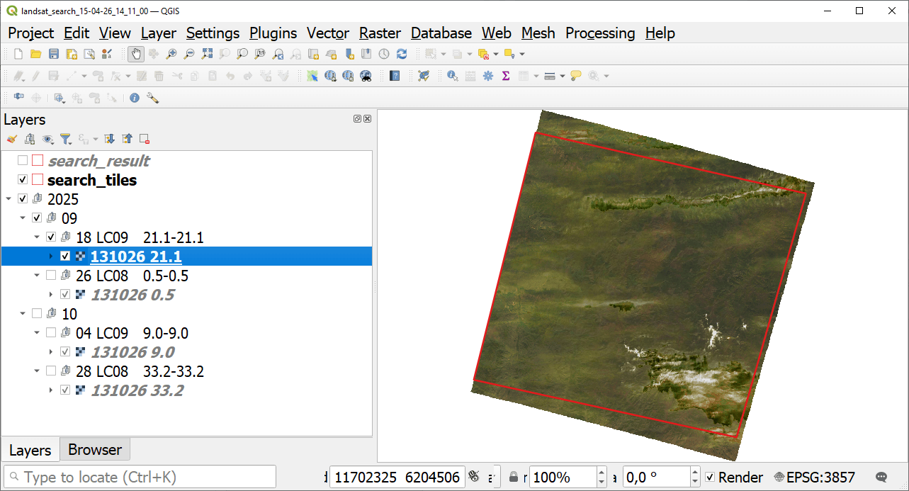

Search and save Landsat-L2C2 scene previews
===========================================

Search Landsat-L2C2 scenes id list and donwload previews as GeoPackage.

Inputs:

* WRS2 tile index(es) - single ID or comma-separated list e.g. ``131026`` or ``131026,132026`` - max 50 IDs;
* Year(s) - single, list or range e.g. ``2016,2020,2021-2024``;
* Month(s) - single, list or range e.g. ``1,5,9-12``;
* Max cloud - Max cloud %, int or float e.g. ``10`` or ``10.5``;
* No preview - tick to download only vector footprints.

Outputs:

* GeoPackage with previews or footprints, contains:

   * QGIS project;
   * Tile boundary;
   * Search area boundary;
   * Raster previews.

* List of scene IDs.

Launch the tool: https://toolbox.nextgis.com/t/landsat_search

Example:

   Example output: scene preview opened in QGIS

**Try the tool in action**

1. Click on the **Demo** button above the tool form. The fields are filled in with demo values.
2. Click on the **Run** button.

.. seealso::

   * `Download Sentinel-2 satellite data <https://toolbox.nextgis.com/t/download_and_prepare_l8_s2?from-related-tools=1>`_
   * `Search and save Sentinel-2 scene previews <https://toolbox.nextgis.com/t/s2_search?from-related-tools=1>`_
   * `Search & download Planetary Computer <https://toolbox.nextgis.com/t/planetary_search?from-related-tools=1>`_
   * `Image clustering <https://toolbox.nextgis.com/t/image_clustering?from-related-tools=1>`_