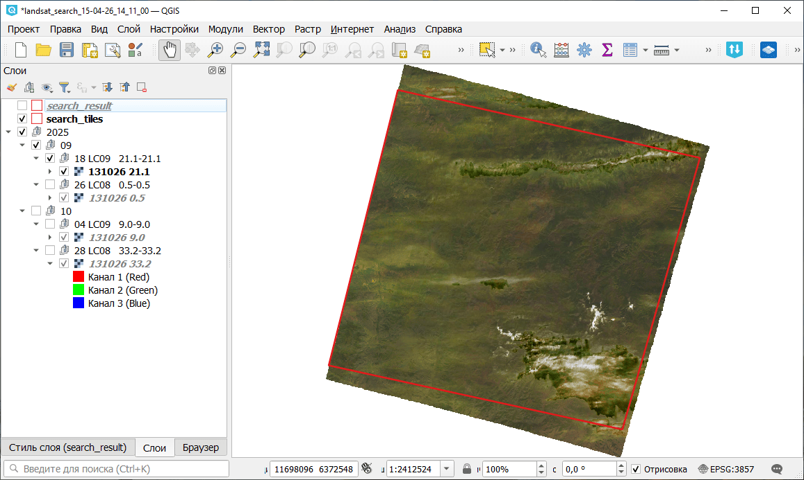

Скачивание превью сцен Landsat-L2C2
============================================

Поиск и импорт превью сцен Landsat-L2C2 в GeoPackage.

На входе:

* Индекс(ы) тайлов - до 50 идентификаторов тайлов S2, разделённых запятой, например ``131026`` или ``131026,132026``;
* Год(ы) съемки - один, список или диапазон,например ``2016,2020,2021-2024``;
* Месяц(ы) съемки - один, список или диапазон,например ``1,5,9-12``;
* Максимальная облачность в процентах, например, ``10`` или ``10.5``;
* Не загружать превью - будут выгружены только итендификаторы сцен и их области покрытия.

На выходе:

* Файл GeoPackage с превью сцен или их охватом. Внутри файла:

   * Проект QGIS
   * Границы тайла
   * Растровые файлы превью (если не выбрана опция их не загружать)

* Список идентификаторов сцен

Запуск инструмента: https://toolbox.nextgis.com/t/landsat_search

Пример работы инструмента:

   Пример результата работы инструмента в NextGIS QGIS

**Попробуйте инструмент в действии:**

1. Нажмите кнопку **Демо** над формой инструмента. Поля будут автоматически заполнены демонстрационными значениями.
2. Нажмите кнопку **Запустить**.

.. seealso::

   * `Скачивание спутниковых данных Sentinel-2 <https://toolbox.nextgis.com/t/download_and_prepare_l8_s2?from-related-tools=1>`_
   * `Поиск ID сцен Sentinel-L2A и загрузка превью <https://toolbox.nextgis.com/t/s2_search?from-related-tools=1>`_
   * `Скачивание данных Planetary Computer <https://toolbox.nextgis.com/t/planetary_search?from-related-tools=1>`_
   * `Кластеризация изображений <https://toolbox.nextgis.com/t/image_clustering?from-related-tools=1>`_

.. hint:: 

   Научиться работать с растровыми данными в QGIS вы можете на нашем курсе `Фундаментальный QGIS <https://nextgis.skillspace.ru/l/qgis>`_