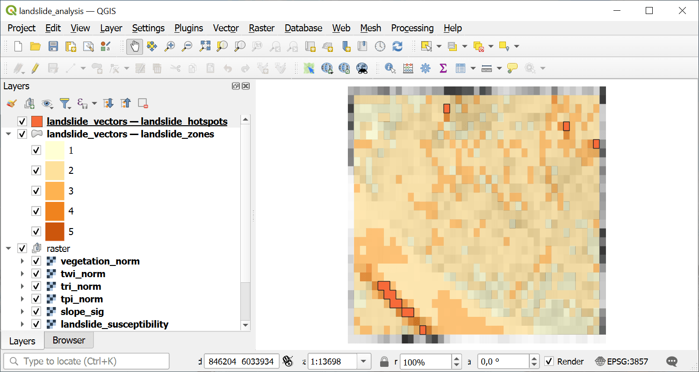

Landslide Susceptibility Analysis
=================================

Heuristic landslide susceptibility index (after Anbalagan 1992) using sigmoid-transformed slope, combined curvature, TWI, dual-scale TPI, TRI, and parabolic elevation risk profile. Produces an LSI scaled 0-100 with 5-level classification.

Inputs:

* Terrain Analysis Package (ZIP). ZIP file from terrain_analysis containing DEM, slope, curvature, TWI, TPI, TRI rasters and manifest.json
* Weight: Slope (sigmoid). Weight for the sigmoid-transformed slope indicator (default: 0.30)
* Weight: Curvature. Weight for the combined curvature indicator (default: 0.15)
* Weight: TWI. Weight for the Topographic Wetness Index (default: 0.20)
* Weight: TPI. Weight for the dual-scale TPI indicator (default: 0.10)
* Weight: TRI. Weight for the Terrain Ruggedness Index (default: 0.15)
* Weight: Elevation Risk. Weight for the parabolic elevation risk profile (default: 0.10)
* Critical Slope Angle (degrees). Slope angle at the sigmoid inflection point in degrees (default: 25.0). Above this angle landslide risk increases sharply.
* Hotspot Threshold. LSI value above which areas are classified as hotspots (default: 70)
* Spectral Indices Package (ZIP). Optional ZIP from spectral_indices with vegetation index aggregates. When provided, a vegetation indicator is added to the weighted overlay.
* Weight: Vegetation Index. Weight for the vegetation index indicator (default: 0.10). Only used when spectral_zip is provided. Other weights are scaled down proportionally.

Outputs:

* Landslide Analysis Package (ZIP). ZIP archive with landslide susceptibility rasters, vectors, statistics, and manifest
* Summary. Human-readable summary of the landslide analysis results
* Manifest JSON. JSON manifest string describing all outputs

Launch the tool: https://toolbox.nextgis.com/t/landslide_analysis

Example:

.. figure:: _static/analysis_input_en.png
   :name: landslide_analysis_input_pic
   :align: center
   :width: 16cm

   Example input

   Example output

**Try the tool in action**

1. Click on the **Demo** button above the tool form. The fields are filled in with demo values.
2. Click on the **Run** button.

.. admonition:: Related tools

   * `Flood Susceptibility Analysis <https://toolbox.nextgis.com/t/flood_analysis?from-related-tools=1>`_
   * `Erosion Susceptibility Analysis <https://toolbox.nextgis.com/t/erosion_analysis?from-related-tools=1>`_
   * `Wildfire Susceptibility Analysis (Topographic) <https://toolbox.nextgis.com/t/wildfire_analysis?from-related-tools=1>`_
