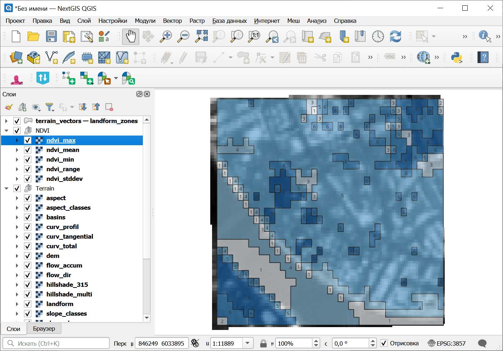
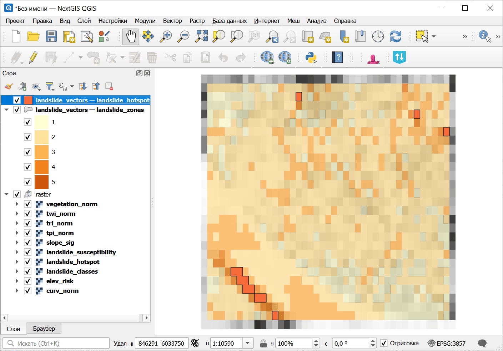

Анализ подверженности оползням
==============================

Эвристический индекс подверженности оползням (по Анбалагану 1992) с использованием сигмоидально преобразованного уклона, комбинированной кривизны, TWI, двухмасштабного TPI, TRI и параболического профиля высотного риска. Создает LSI от 0 до 100 с 5-уровневой классификацией.

На входе:

* Пакет анализа рельефа (ZIP).  ZIP-файл, полученный из инструмента `Комплексный анализ рельефа <https://toolbox.nextgis.com/t/terrain_analysis>`_, содержит ЦМР, уклон, аккумуляцию стока, кривизну, STI, SPI и manifest.json;
* Вес: Уклон (сигмоида). Вес индикатора сигмоидального уклона (по умолчанию: 0.30);
* Вес: Кривизна. Вес индикатора комбинированной кривизны (по умолчанию: 0.15);
* Вес: TWI. Вес индекса топографической влажности (по умолчанию: 0.20);
* Вес: TPI. Вес двухмасштабного индикатора TPI (по умолчанию: 0.10);
* Вес: TRI. Вес индекса пересеченности рельефа (по умолчанию: 0.15);
* Вес: Высотный риск. Вес параболического профиля высотного риска (по умолчанию: 0.10);
* Критический угол наклона (градусы). Угол наклона в точке перегиба сигмоиды в градусах (по умолчанию: 25.0). Выше этого угла риск оползня резко возрастает;
* Порог горячих точек. Значение LSI, выше которого области классифицируются как горячие точки (по умолчанию: 70);
* Пакет спектральных индексов (ZIP). Необязательный ZIP с агрегатами вегетационного индекса, полученный инструментом `Вычисление спектральных индексов <https://toolbox.nextgis.com/t/spectral_indices>`_. При указании в взвешенное наложение добавляется вегетационный индикатор;
* Вес: Вегетационный индекс. Вес индикатора вегетационного индекса (по умолчанию: 0.10). Используется только при наличии spectral_zip. Остальные веса пропорционально уменьшаются.

На выходе:

* Пакет анализа оползней (ZIP). ZIP-архив с растрами подверженности оползням, векторами, статистикой и манифестом
* Сводка. Текстовая сводка результатов анализа оползней
* Манифест JSON. JSON-манифест, описывающий все результаты

Запуск инструмента: https://toolbox.nextgis.com/t/landslide_analysis

Пример работы инструмента:

   Пример исходных данных

   Пример результата работы инструмента

**Попробуйте инструмент в действии:**

1. Нажмите кнопку **Демо** над формой инструмента. Поля будут автоматически заполнены демонстрационными значениями.
2. Нажмите кнопку **Запустить**.

.. seealso::

   * `Комплексный анализ рельефа <https://toolbox.nextgis.com/t/terrain_analysis>`_
   * `Анализ подверженности затоплению <https://toolbox.nextgis.com/t/flood_analysis?from-related-tools=1>`_
   * `Анализ подверженности эрозии <https://toolbox.nextgis.com/t/erosion_analysis?from-related-tools=1>`_
   * `Анализ подверженности лесным пожарам (топографический) <https://toolbox.nextgis.com/t/wildfire_analysis?from-related-tools=1>`_
