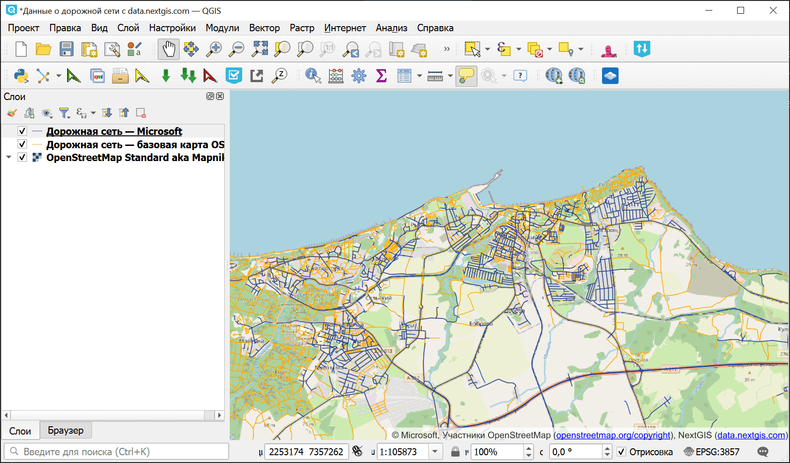
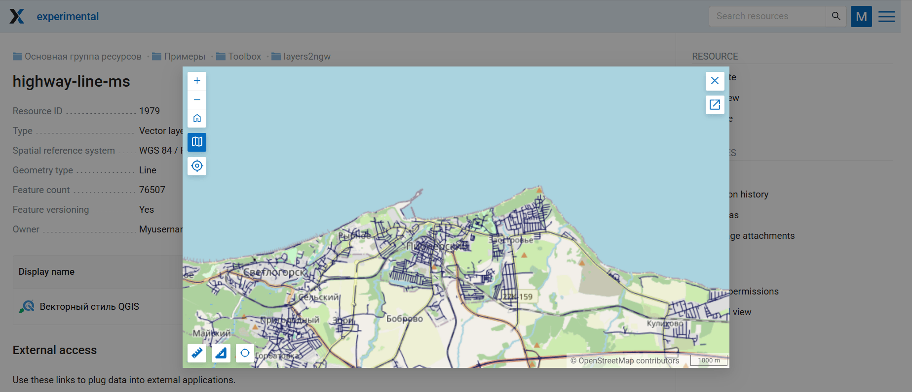

Векторные слои из архива в Веб ГИС
=====================================

Инструмент позволяет создать в Веб ГИС сразу много слоёв из набора файлов, загружаемого в виде ZIP-архива. Например, вы можете `купить данные на NextGIS Data <https://docs.nextgis.ru/docs_toolbox/source/layers2ngw.html>`_ и загрузить их в свою Веб ГИС.

На входе:

* Веб ГИС - Адрес вида https://sandbox.nextgis.com;
* Логин - адрес электронной почты, на которую создан NextGIS ID;
* Пароль;
* ID группы ресурсов - номер, которым заканчивается адрес папки в строке браузера. Для Основной группы ресурсов ID=0;
* ZIP-архив - архив с файлами GPKG, SHP или GeoJSON. Поддерживается загрузка QML с именем как у векторного файла (Сохранить все слои проекта в файлы можно модулем `Quickly save default QML <https://docs.nextgis.ru/docs_ngqgis/source/quicksaveqml.html>`_. Архив может содержать в себе вложенные папки, но в Веб ГИС все слои будут в указанной группе ресурсов на одном уровне;
* Файл QML - опционально: QML файл, который будет приложен ко всем загруженным слоям. Должен быть подходящего типа геометрии.

На выходе:

* В Веб ГИС в указанной папке создаются векторные слои.

Запуск инструмента: https://toolbox.nextgis.com/t/layers2ngw

Пример работы инструмента:

   Данные о дорожной сети с NextGIS Data

   Предпросмотр одного из загруженных в Веб ГИС слоёв

**Попробуйте инструмент в действии**

1. Нажмите кнопку **Демо** над формой инструмента. Поля будут автоматически заполнены демонстрационными значениями.
2. Нажмите кнопку **Запустить**.

.. seealso::

   * Если у вас настроенный проект со стилями в QGIS, то его можно загрузить в Веб ГИС при помощи модуля `NextGIS Connect <https://docs.nextgis.ru/docs_ngconnect/source/index.htmlы>`_
   * `Векторные слои из Веб ГИС в GeoPackage <https://toolbox.nextgis.com/t/ngw_to_gpkg?from-related-tools=1>`_