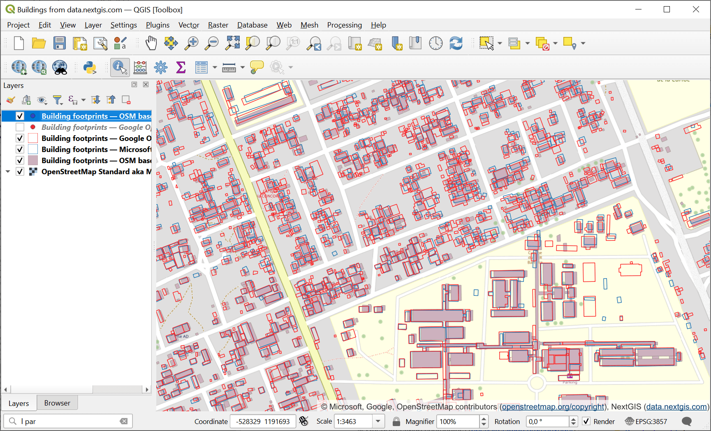
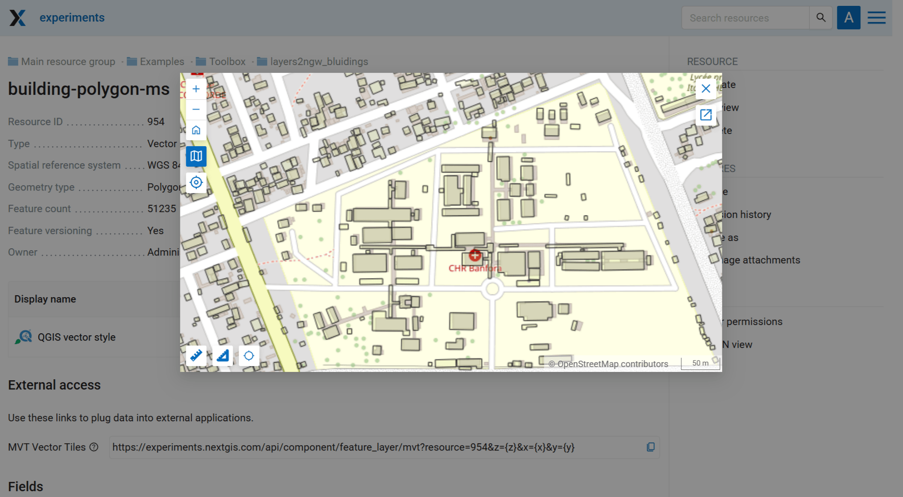

Vector layers in Web GIS from archive 
=========================================

This tool allows to create multiple vector layers in Web GIS at once using a ZIP archive of geodata files. For example, you can `buy data on NextGIS Data <https://data.nextgis.com/en/>`_ and upload it to your Web GIS.

Input:

* Web GIS - URL of the Web GIS, i.e. https://sandbox.nextgis.com
* Username - your NextGIS ID;
* Password
* Resource group ID - Number at the end of the link to the folder. For Main resource group ID=0
* ZIP archive - ZIP archive with GPKG, SHP or GeoJSON files. May contain sidecar QML file (To save all the styles as files use `Save default QML plugin <https://docs.nextgis.com/docs_ngqgis/source/quicksaveqml.html>`_). May include subfolders.
* QML file - optional, QML file of a style that will be added to all the loaded layers. Make sure the geometry type is correct.

Output:

* Layers created in NextGIS Web in the selected resource group

Example:

   Building footprints data from NextGIS Data in QGIS

   Preview of one of the layers in Web GIS

Launch the tool: https://toolbox.nextgis.com/t/layers2ngw

**Try the tool in action**

1. Click on the **Demo** button above the tool form. The fields are filled in with demo values.
2. Click on the **Run** button.

.. admonition:: Related tools

  * If you have a styles QGIS project, you can upload it to Web GIS via `NextGIS Connect plugin <https://docs.nextgis.com/docs_ngconnect/source/index.html>`_
  * `Vector layers from Web GIS to GeoPackage <https://toolbox.nextgis.com/t/ngw_to_gpkg?from-related-tools=1>`_