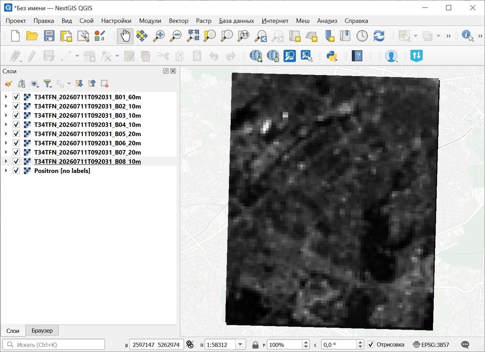
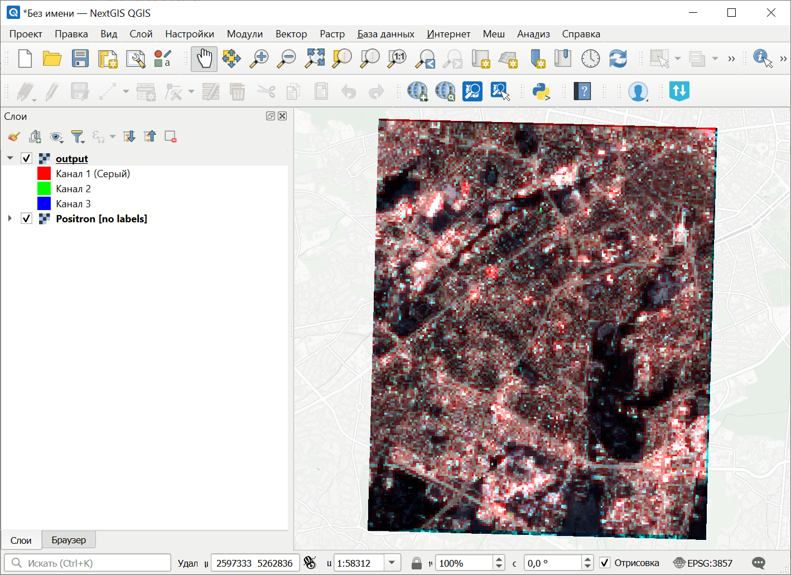

Формирование многоканального растра из отдельных каналов
========================================================

Формирует из архива с растровыми каналами один многоканальный растр. 

На входе:

* ZIP-архив, содержащий растры с растровыми каналами, без вложенных папок.
* Список каналов через запятую, например 4,3,2. Порядок растров алфавитный, т.е. 1 - первый по алфавиту растр исходного архива.

На выходе:

* Многоканальный растр в формате TIF.

Запуск инструмента: https://toolbox.nextgis.com/t/layerstack

Пример работы инструмента:

   Пример исходных данных: одноканальные растры в разных диапазонах

   Пример результата работы инструмента: получившийся цветной растр

**Попробуйте инструмент в действии:**

1. Нажмите кнопку **Демо** над формой инструмента. Поля будут автоматически заполнены демонстрационными значениями.
2. Нажмите кнопку **Запустить**.

.. seealso::

   * `Создание тайлового набора по растру <https://toolbox.nextgis.com/t/raster2tiles?from-related-tools=1>`_
   * `Скачивание данных Planetary Computer <https://toolbox.nextgis.com/t/planetary_search?from-related-tools=1>`_
   * `Калькулятор растров (GRASS) <https://toolbox.nextgis.com/t/r_mapcalc?from-related-tools=1>`_

