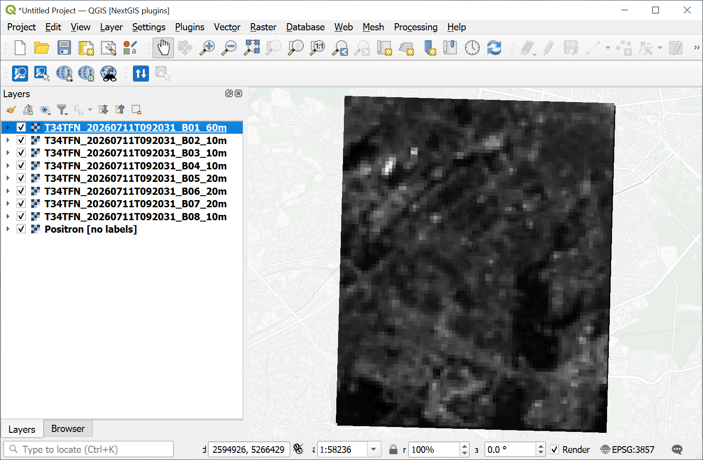
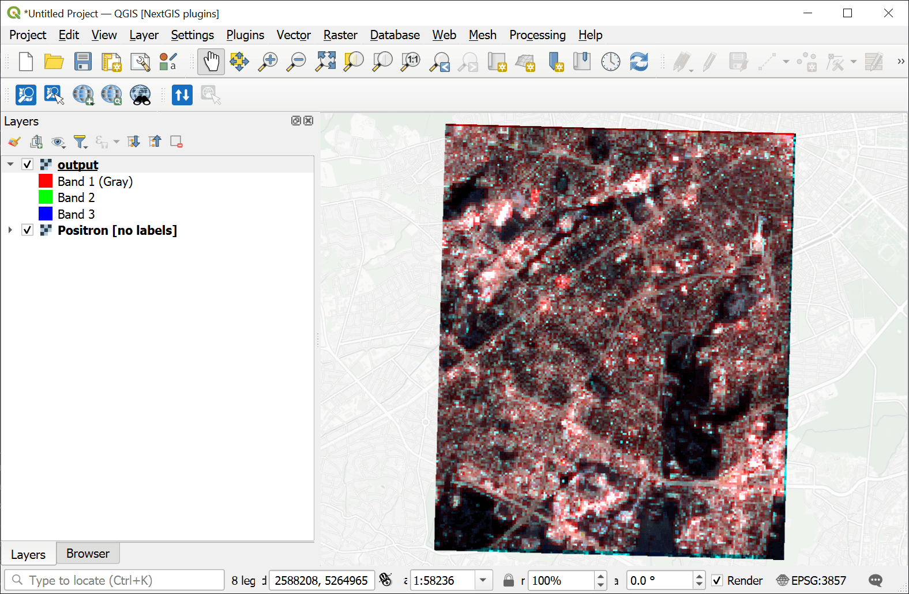

Form multi-channel raster from individual channels
====================================================

Converts an archive with raster channels to a single multi-channel raster. The option to specify which channels to stack and in what order, for example, 4, 3, 2. The raster order is always alphabetical, i.e., 1 channel = 1 raster

Inputs:

* ZIP-archive with single-channel rasters, without subfolders.
* List of channels, comma-separated. Input rastered are sorted alphabetically, so 1 is the first.

Outputs:

* Multi-channel RGB raster as a TIF file.

Launch the tool: https://toolbox.nextgis.com/t/layerstack

Example:

   Example input: multiple single-channel rasters

   Example output: combined RGB raster

**Try the tool in action**

1. Click on the **Demo** button above the tool form. The fields are filled in with demo values.
2. Click on the **Run** button.
