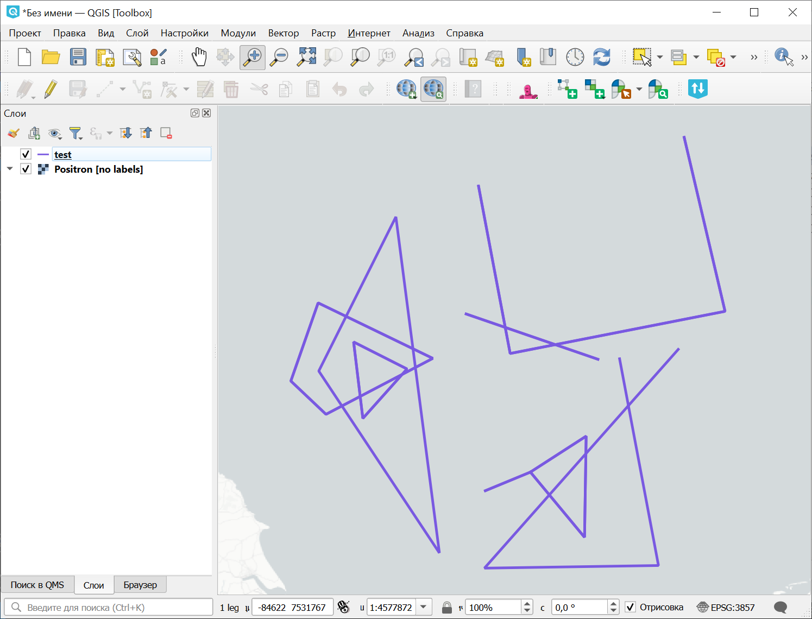
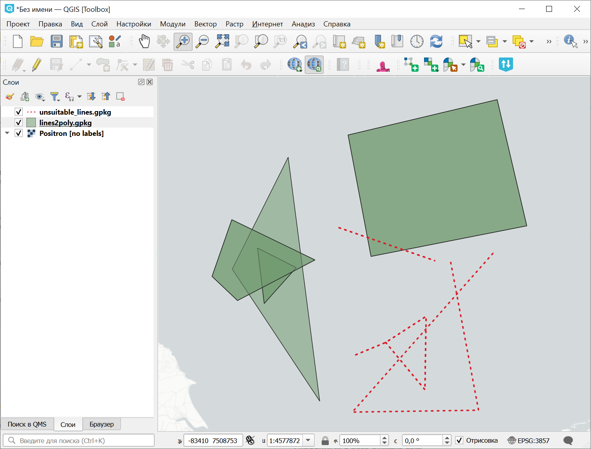

Сконвертировать линии в полигоны
================================

Каждая линия превращается в полигон. Вырожденные линии с самопересечениями - отбрасываются. Мультилинии превращаются в набор отдельных линий.

На входе:

* линейный векторный слой в формате geojson, geopackage или архивированный в zip ESRI Shapefile.

На выходе: 

* полигональный слой в формате geojson или geopackage, линейный слой с оставшимися самопересекающимися линиями.

Запуск инструмента: https://toolbox.nextgis.com/t/lines2poly

Пример работы инструмента:

   Пример исходных данных

   Полученные полигоны и линии, из которых не удалось создать полигоны

**Попробуйте инструмент в действии, скачав наш пример:**

`Набор исходных данных <https://nextgis.ru/data/toolbox/lines2poly/lines2poly_inputs_ru.zip>`_ для проверки работы инструмента. Внутри архива пошаговая инструкция.

`Пример результата <https://nextgis.ru/data/toolbox/lines2poly/lines2poly_outputs_ru.zip>`_ работы инструмента.

.. seealso::

   * `Полигоны из линий и точек по времени <https://toolbox.nextgis.com/t/lines2polygons>`_