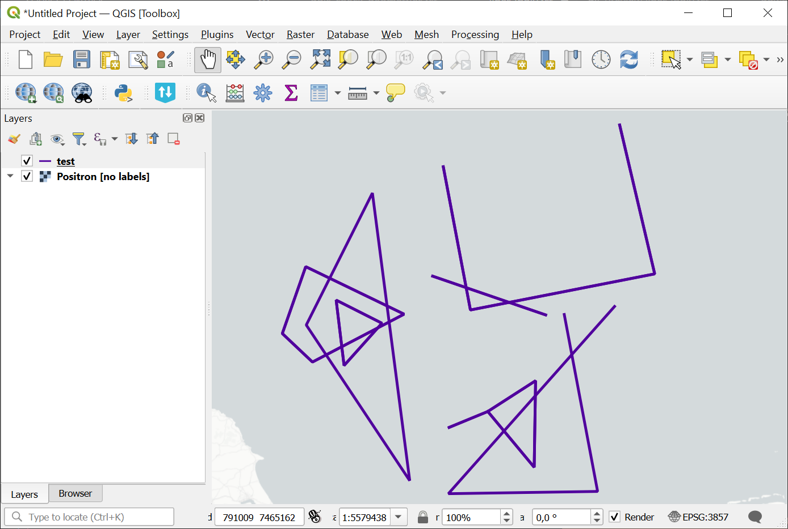
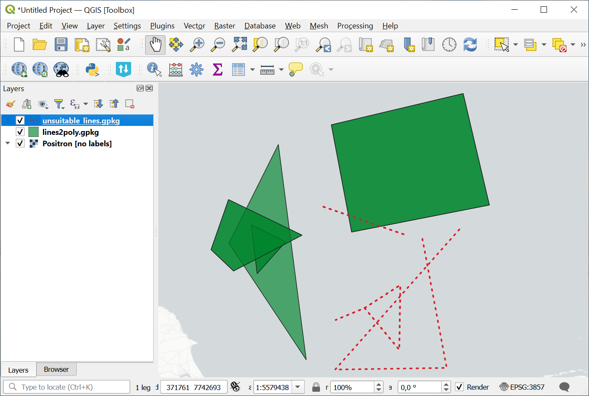

Lines to polygons
=========================

Each line turns into a polygon. Straight and self-intersected lines are omitted.  Multilines are exploded to multiple features.

Input: 

* Linear vector layer in GeoJSON or GeoPackage format or ESRI Shapefile in a zip archive.

Output: 

* Polygon layer;
* Linear layer with remaining self-intersecting lines.

Both files are in the same format as the input.

Launch the tool: https://toolbox.nextgis.com/t/lines2poly

Example:

   Example input

   Example output: polygons and sefl-intersecting lines

**Try the tool in action**

1. Click on the **Demo** button above the tool form. The fields are filled in with demo values.
2. Click on the **Run** button.
