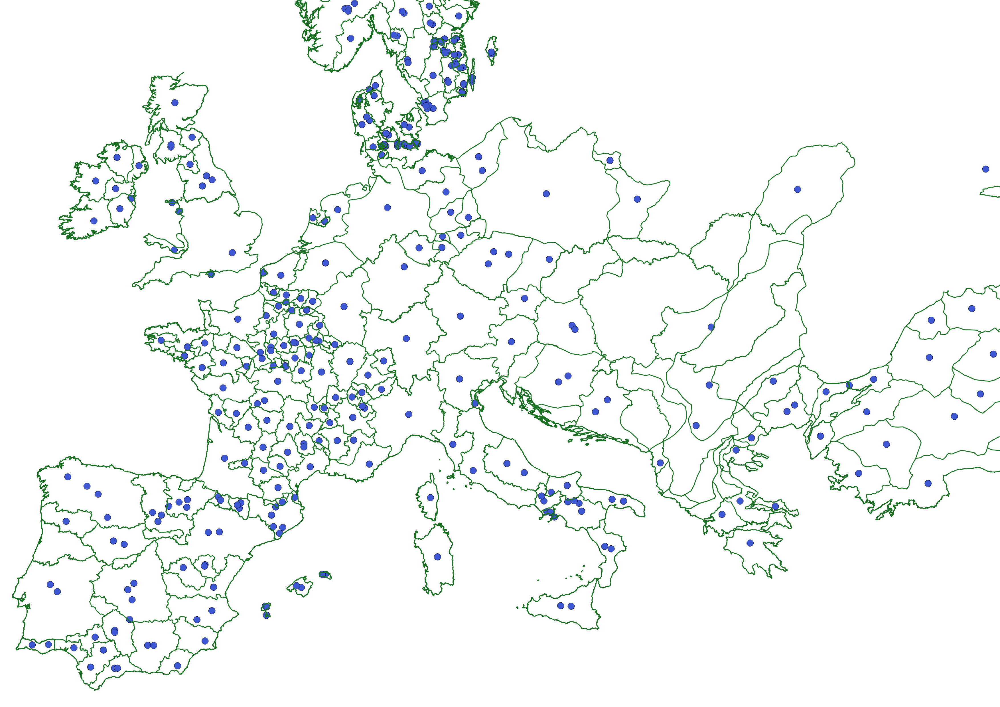
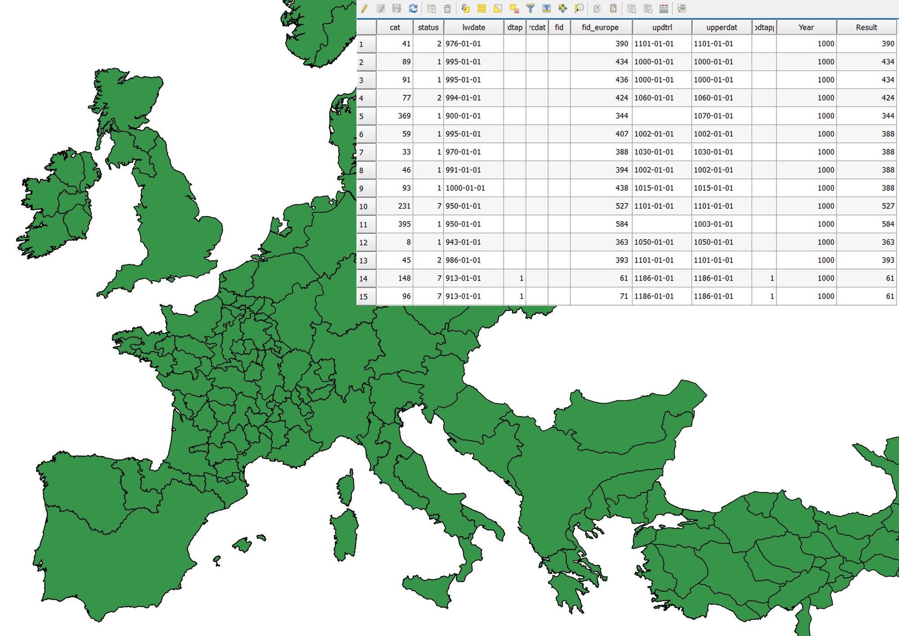

Temporal polygons from lines and points
=======================================

The tool creates polygons that reflect the state of the area at a particular point in time. Polygons are formed from a set of polylines, each of which is characterized by the start and end dates of its existence. Attributes for polygons are assigned from a layer of points, which also has a time reference.

In addition, grouping of polygon identifiers by a given parameter is carried out by creating a separate field with an ID common to each group (its minimum value). The geometry of the polygons does not change.

**Preparing the data**

Make sure to set the following access permissions for both layers: Resource: Read and Data: Read data for **Guest**. All the resource groups that include the layers, up to the Main resource group, must also have Resource: Read permission set for Guest.

The layer of polylines must include the following fields:

* upperdat - the start date of the line's existence;
* lwdate - the end date of the line's existence;
* a field that will be used for grouping.

   
   Input data. Layers of polylines and points 
   
.. to do:: _static/lines2polygons_lines_table.png
   :align: center
   :width: 16cm
   
   Input data. Polyline Layer Attributes Table  
   

   
   An example of the result of a tool    

Inputs:

*  Web GIS URL - address of the used Web GIS (it must end on *.com*, no / or other symbols after it)
*  Line resource ID - ID of the polyline layer from the used Web GIS
*  Point resource ID - ID of the layer with points from the used Web GIS
*  Requested year - the year for which you want to get a time slice
*  Request year field name - name of the field where the requested year will be written
*  Result field - a new field where the grouping results will be entered, that is, ID
*  ID field - a field with unique values in the polyline layer; IDs for grouping are borrowed from it 
*  Group field - the field by which polygons are grouped

Outputs:

*  a layer with polygons (shapefile) relevant for the given year

Launch the tool: https://toolbox.nextgis.com/t/lines2polygons

 

.. to do:: **Try it out using our sample:** Download `input dataset <https://nextgis.com/data/toolbox/lines2polygons/lines2polygons_inputs.zip>`_ to test the instrument. Step-by-step instructions included. Get the `output <https://nextgis.com/data/toolbox/lines2polygons/lines2polygons_outputs.zip>`_ to additionally check the results.

.. admonition:: Related tools

   * `Convert lines to polygons <https://toolbox.nextgis.com/t/lines2poly?from-related-tools=1>`_