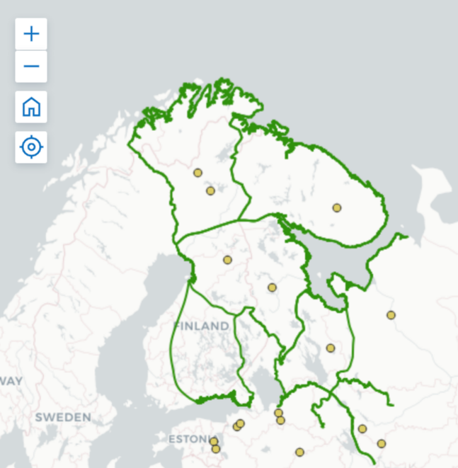
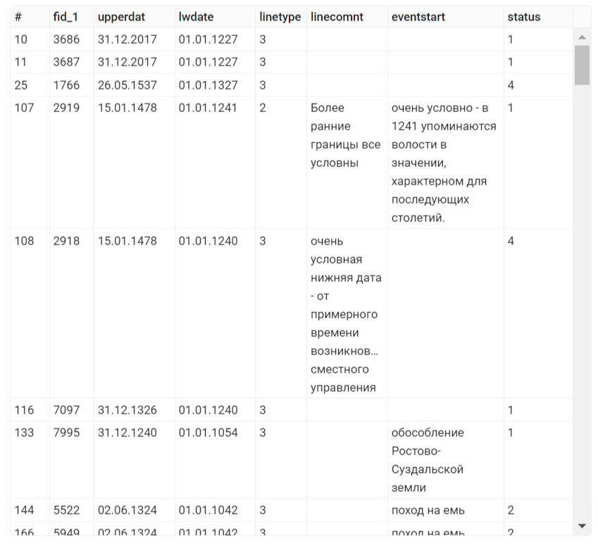
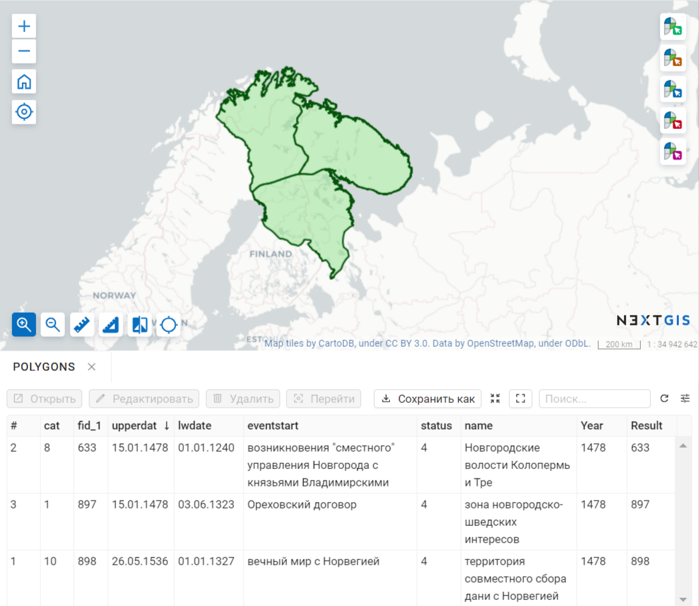

Полигоны из линий и точек по времени
====================================

Инструмент создает полигоны, отражающие состояние местности на конкретный момент времени. Полигоны формируются из набора контуров (полилиний), каждый из которых характеризуется датой начала и окончания своего существования. Атрибуты полигонам присваиваются из слоя точек, которые также имеют временную привязку.

Кроме того, осуществляется группировка идентификаторов полигонов по заданному параметру через создание отдельного поля с ID, общим для каждой группы (минимальное его значение). Геометрия полигонов при этом не меняется.

**Подготовка данных:**

Для слоёв Веб ГИС должны быть `установлены права <https://docs.nextgis.ru/docs_ngcom/source/permissions.html>`_ "Ресурс:чтение" и "Чтение данных" для пользователя **Гость**. Право чтения ресурса также должно быть выставлено для папок всех уровней, в которые входят эти слои, вплоть до Основной группы ресурсов.

Слой полилиний должен содержать следующие **поля**: 

* upperdat - дата начала существования контура;
* lwdate - дата окончания существования контура;
* поле группировки с пользовательским названием на латинице.

   
   Пример исходных данных. Слои полилиний и точек 
   

   
   Пример исходных данных. Таблица атрибутов слоя полилиний  
   

   
   Пример результата работы инструмента    

На входе:

*  Web GIS URL - адрес используемой Веб ГИС (обратите внимание, что после *.com* не должно быть дополнительных символов)
*  ID ресурса линий - ID слоя с полилиниями из используемой Веб ГИС
*  ID ресурса точек - ID слоя с точками из используемой Веб ГИС
*  Запрашиваемый год - год, на который нужно получить временной срез
*  Имя поля запрашиваемого года - название нового поля, куда будет записываться запрашиваемый год
*  Поле результата - новое поле, куда будут заноситься результаты группировки, то есть ID.
*  Поле с идентификаторами - поле в слое полилиний с уникальными значениями, из него заимствуются ID для группировки 
*  Поле группировки - поле слоя полилиний, по которому осуществляется группировка полигонов

На выходе:

*  слой с полигонами (shapefile), актуальными для заданного года

Запуск инструмента: https://toolbox.nextgis.com/operation/lines2polygons

 
**Попробуйте инструмент в действии, скачав наш пример:**

`Набор исходных данных <https://nextgis.ru/data/toolbox/lines2polygons/lines2polygons_inputs_ru.zip>`_ для проверки работы инструмента. Внутри архива пошаговая инструкция.

`Пример результата <https://nextgis.ru/data/toolbox/lines2polygons/lines2polygons_outputs_ru.zip>`_ работы инструмента.
