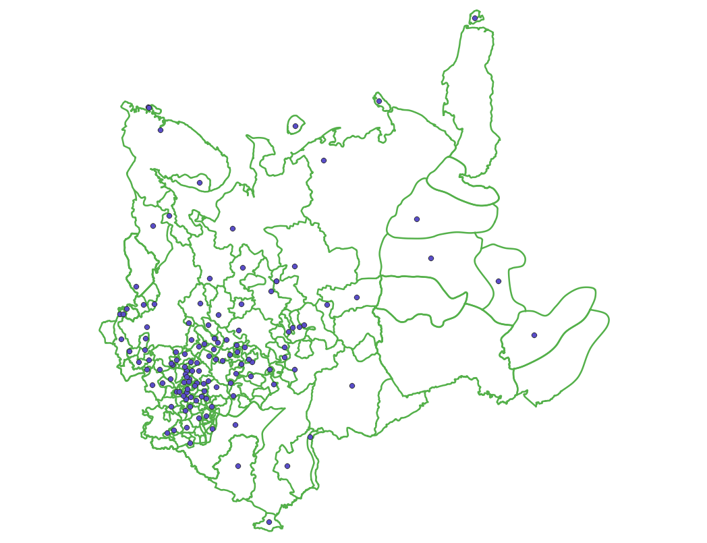
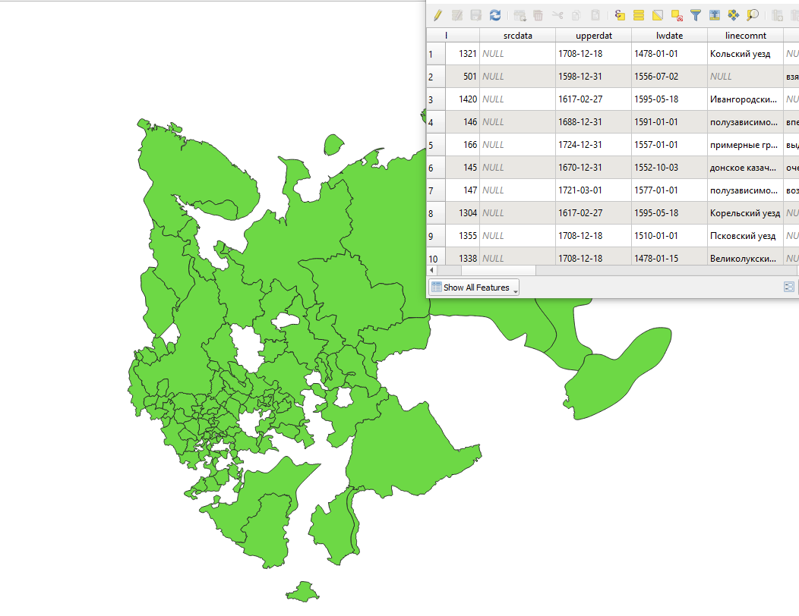

Temporal polygons from lines and points
=======================================

The tool creates polygons that reflect the state of the area at a particular point in time. Polygons are formed from a set of polylines, each of which is characterized by the start and end dates of its existence. Attributes for polygons are assigned from a layer of points, which also has a time reference.

In addition, grouping of polygon identifiers by a given parameter is carried out by creating a separate field with an ID common to each group (its minimum value). The geometry of the polygons does not change.

Inputs:

*  gis_url - address of the used Web GIS
*  lines_id - ID of the polyline layer from the used Web GIS
*  points_id - ID of the layer with points from the used Web GIS
*  Requested year - the year for which you want to get a time slice
*  year_field - name of the field where the requested year will be written
*  Result field - a new field where the grouping results will be entered, that is, ID
*  Field with identifiers - a field with unique values in the polyline layer; IDs for grouping are borrowed from it 
*  Grouping field - the field by which polygons are grouped

Outputs:

*  a layer with polygons (shapefile) relevant for the given year

Launch tool: https://toolbox.nextgis.com/operation/lines2polygons

 

   
   Sample input data. Layers of polylines and dots 
   
.. figure:: _static/lines2polygons_lines_table2.png
   :align: center
   :width: 16cm
   
   Sample input data. Polyline Layer Attributes Table  
   

   
   An example of the result of a tool    

**Try it out using our sample:**

Download `input dataset <https://nextgis.com/data/toolbox/lines2polygons/lines2polygons_inputs.zip>`_ to test the instrument. Step-by-step instructions included.

Get the `output <https://nextgis.com/data/toolbox/lines2polygons/lines2polygons_outputs.zip>`_ to additionally check the results.
