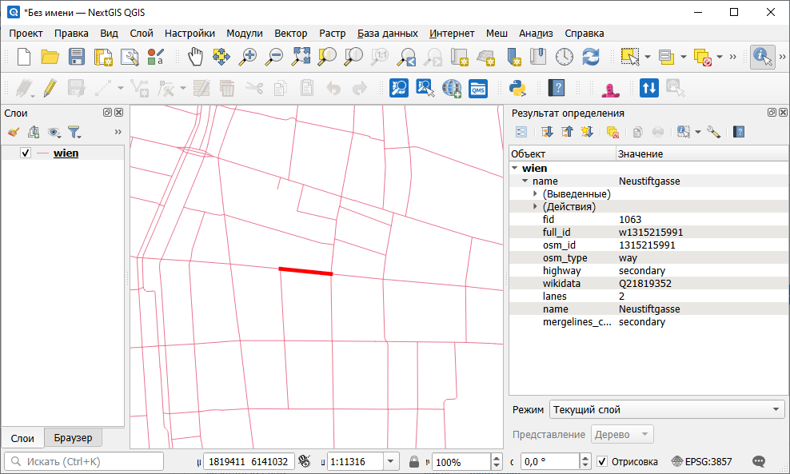
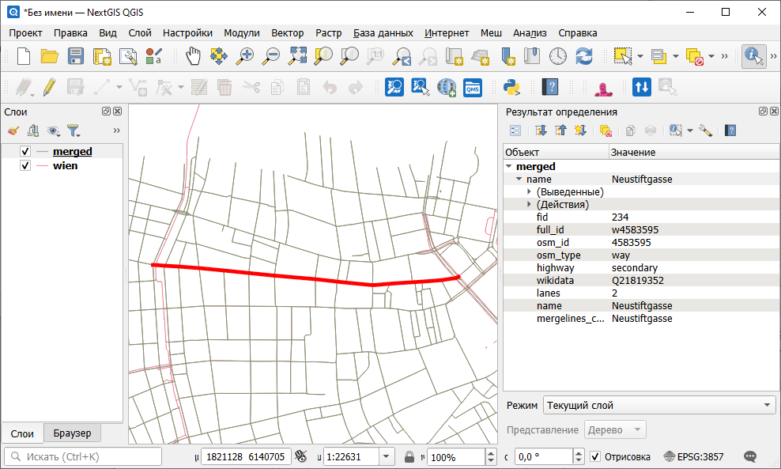

Объединение линий в единые геометрии
====================================

Создание линейного векторного слоя, где стыкующиеся линии объединены в одиночные линии. 

Этот инструмент позволяет собрать из фрагментов дороги, реки и т.п.

На входе:

* Исходный слой - линейный слой в любом OGR-совместимом формате;
* Разделить по значениям атрибута - слой будет разделён на подмножества, например для слоя дорог атрибут highway обозначает что дороги разных классов не будут объединяться, даже если стыкуются между собой.

На выходе:

* Объединённые линии в файле GeoPackage;
* Отчёт о количестве созданных объектов.

Запуск инструмента: https://toolbox.nextgis.com/t/lines_merge

Пример работы инструмента:

   Пример исходных данных: улицы состоят из маленьких фрагментов

   Пример результата работы инструмента: улица объединена в одну линию

**Попробуйте инструмент в действии:**

1. Нажмите кнопку **Демо** над формой инструмента. Поля будут автоматически заполнены демонстрационными значениями.
2. Нажмите кнопку **Запустить**.

.. seealso::

   * `Объединение слоя и таблицы по полю <https://toolbox.nextgis.com/t/join_by_field?from-related-tools=1>`_
   * `Исправление геометрий <https://toolbox.nextgis.com/t/fix_geometries?from-related-tools=1>`_
   * `Центральные линии полигонов <https://toolbox.nextgis.com/t/centerline?from-related-tools=1>`_
