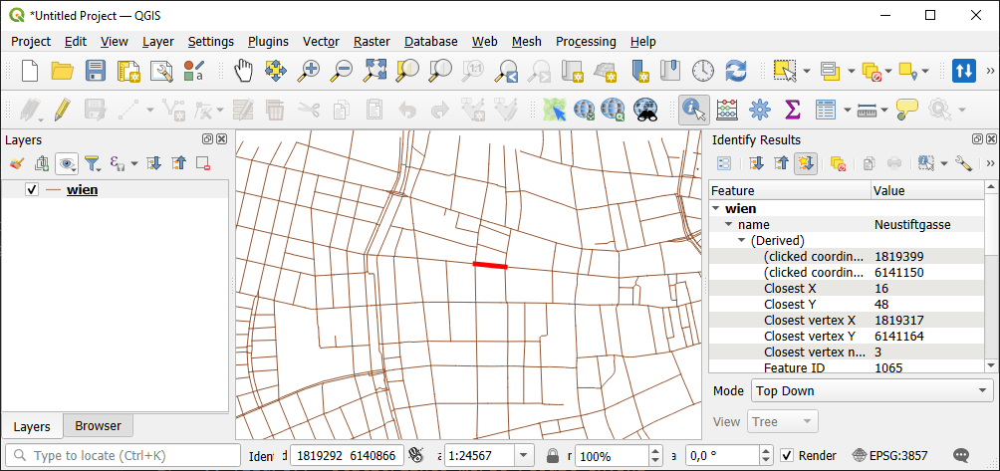
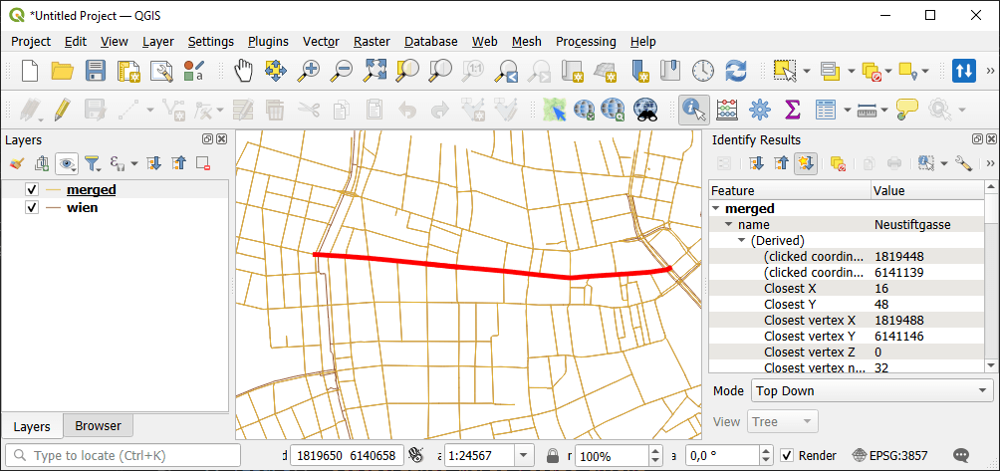

Merge connected lines
======================

Generate linear vector file with merged highways, rivers or simlar features.

Inputs:

* Source layer - linear layer in any OGC format;
* Group by attribute - if a field name is entered, the layer will split by separate subsets by this attribute. For example, for highways layer set attribute 'highway' to avoid merging roads of different categories (i.e. primary, secondary etc).

Outputs:

* GeoPackage with merged features;
* Report on the number of created features.

Launch the tool: https://toolbox.nextgis.com/t/lines_merge

Example:

   Example input: a street split in small segments

   Example output: merged street

**Try the tool in action**

1. Click on the **Demo** button above the tool form. The fields are filled in with demo values.
2. Click on the **Run** button.

.. admonition:: Related tools

   * `Join layer and table by field <https://toolbox.nextgis.com/t/join_by_field?from-related-tools=1>`_
   * `Fix geometries <https://toolbox.nextgis.com/t/fix_geometries?from-related-tools=1>`_
   * `Central lines of polygons <https://toolbox.nextgis.com/t/centerline?from-related-tools=1>`_