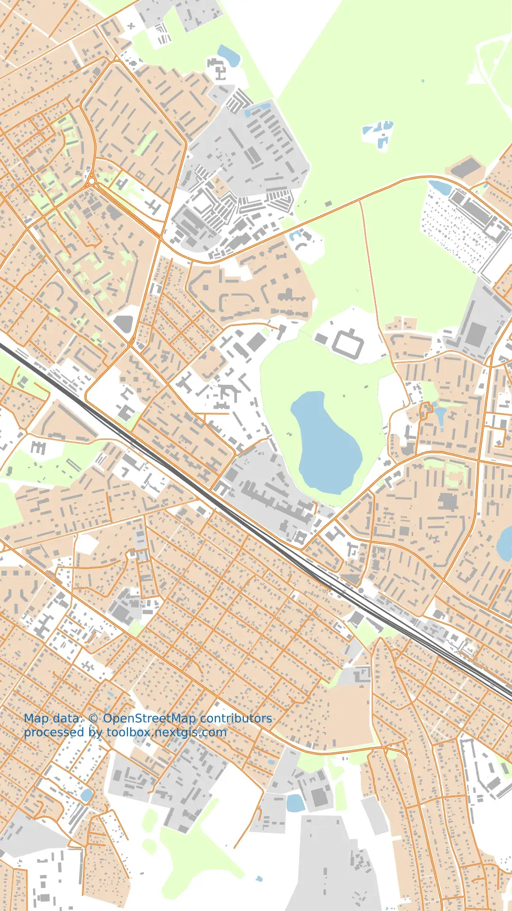

Карта для соцсетей
==================

Генерация карты: как картинки для публикации в социальные сети. Карта получится в вертикальном формате и без подписей. Вы сможете наложить маркеры и нужные надписи в редакторе изображений и при публикации в вашей соцсети.

На входе:

* Охват карты (bbox). Задайте охват на карте или впишите в географических координатах в формате низ, лево, верх, право (юг, запад, север, восток), например: ``30.1,54.9,30.9,55.1``.

На выходе:

* Изображение в формате WEBP

Запуск инструмента: https://toolbox.nextgis.com/t/mappy

Пример работы инструмента:

   Пример результата работы инструмента

**Попробуйте инструмент в действии, скачав наш пример:**

`Набор исходных данных <https://nextgis.ru/data/toolbox/mappy/mappy_inputs_ru.zip>`_ для проверки работы инструмента. Внутри архива пошаговая инструкция.

`Пример результата <https://nextgis.ru/data/toolbox/mappy/mappy_outputs_ru.zip>`_ работы инструмента.

.. seealso::

   * `Карта OSM в PDF для печати <https://toolbox.nextgis.com/t/pdf2data>`_
   * `Конвертация проекта QGIS в PDF <https://toolbox.nextgis.com/t/qgis2pdf>`_