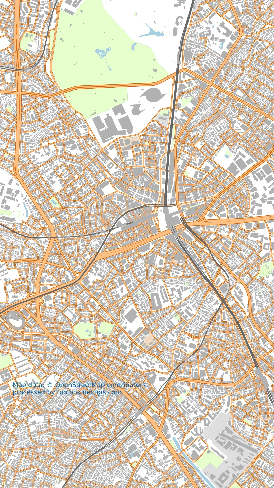

Vertical map for Social Media
=============================

Generate map image prepared for posting in social networks like Instagram and TikTok. Map is designed for simplicity: it has vertical aspect ratio and does not have labels. You will be able to overlay markers and labels in any image editor or while posting on social media.

Inputs:

* Map Extent (bbox). Comma-separated bounding box in geographic coordinates: xmin,ymin,xmax,ymax (S,W,N,E), example: ``30.1,54.9,30.9,55.1'``.

Outputs:

* Output image in WEBP format.

Launch the tool: https://toolbox.nextgis.com/t/mappy

Example:

   Example output

**Try the tool in action**

1. Click on the **Demo** button above the tool form. The fields are filled in with demo values.
2. Click on the **Run** button.

.. seealso::

  * `Map from OSM to PDF for printing <https://toolbox.nextgis.com/t/pdf2data?from-related-tools=1>`_
  * `QGIS project to PDF <https://toolbox.nextgis.com/t/qgis2pdf?from-related-tools=1>`_