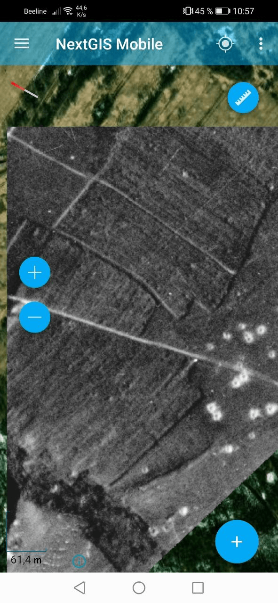

MBTiles to NGRC
===============

Converts MBTiles raster to NGRC format

Inputs:

* Raster dataset. MBTiles raster

Outputs:

* None
* None

Launch the tool: https://toolbox.nextgis.com/t/mbtiles2ngrc

Example:

   Example output

**Try the tool in action**

1. Click on the **Demo** button above the tool form. The fields are filled in with demo values.
2. Click on the **Run** button.

.. admonition:: Related tools

   * `Geodata to PMTiles <https://toolbox.nextgis.com/t/geodata2pmtiles?from-related-tools=1>`_
   * `Raster to NGRC <https://toolbox.nextgis.com/t/raster2tiles>`_