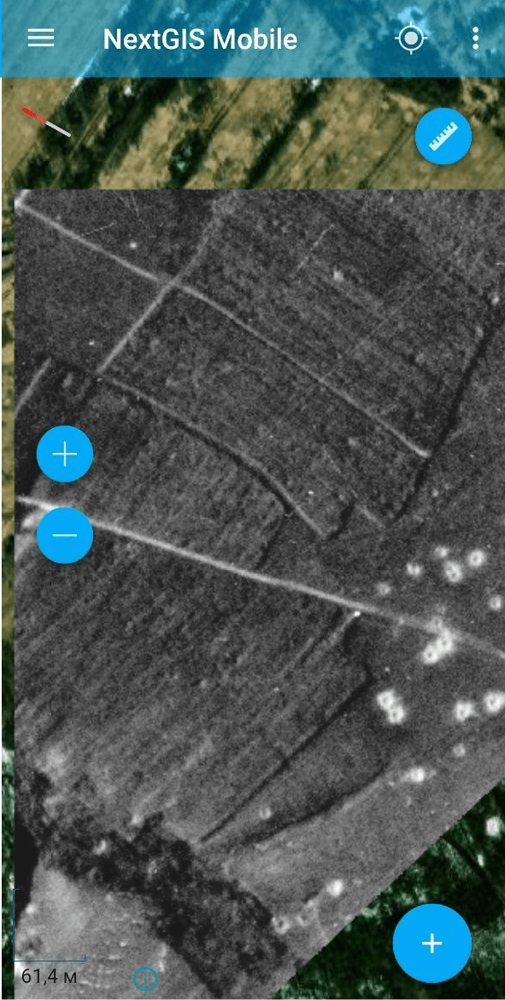

MBTiles в NGRC
==============

Конвертация набора тайлов, сохранённого в формате MBTiles, в формат NGRC для NextGIS Mobile.

На входе:

* Исходный растр - растр в формате MBTiles.

На выходе:

* Набор тайлов в формате NGRC;
* Отчёт, содержащий информацию о масштабах, количестве тайлов и формате изображения.

Запуск инструмента: https://toolbox.nextgis.com/t/mbtiles2ngrc

Пример работы инструмента:

   Данные аэрофотосъёмки загружены в NextGIS Mobile

**Попробуйте инструмент в действии:**

1. Нажмите кнопку **Демо** над формой инструмента. Поля будут автоматически заполнены демонстрационными значениями.
2. Нажмите кнопку **Запустить**.

.. seealso::

   * `Геоданные в PMTiles <https://toolbox.nextgis.com/t/geodata2pmtiles?from-related-tools=1>`_
   * `Растр в NGRC <https://toolbox.nextgis.com/t/raster2tiles>`_