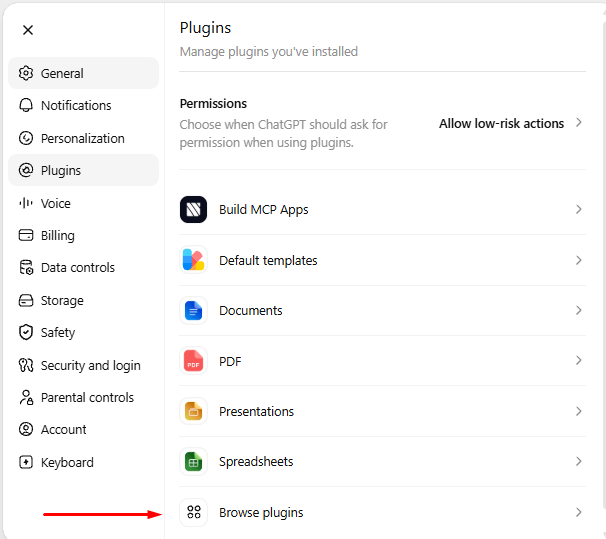
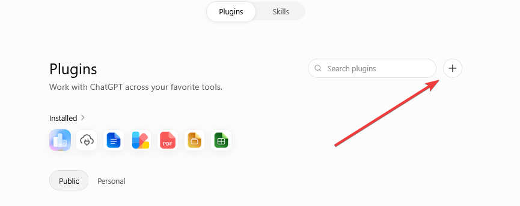
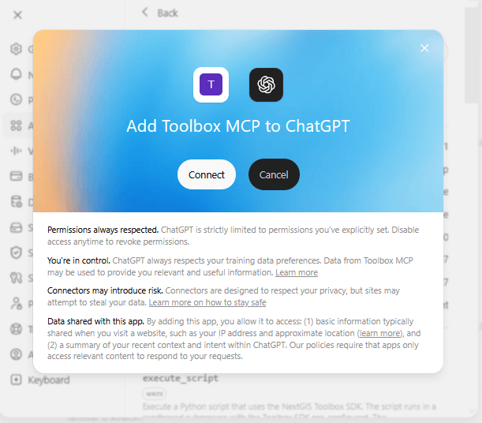
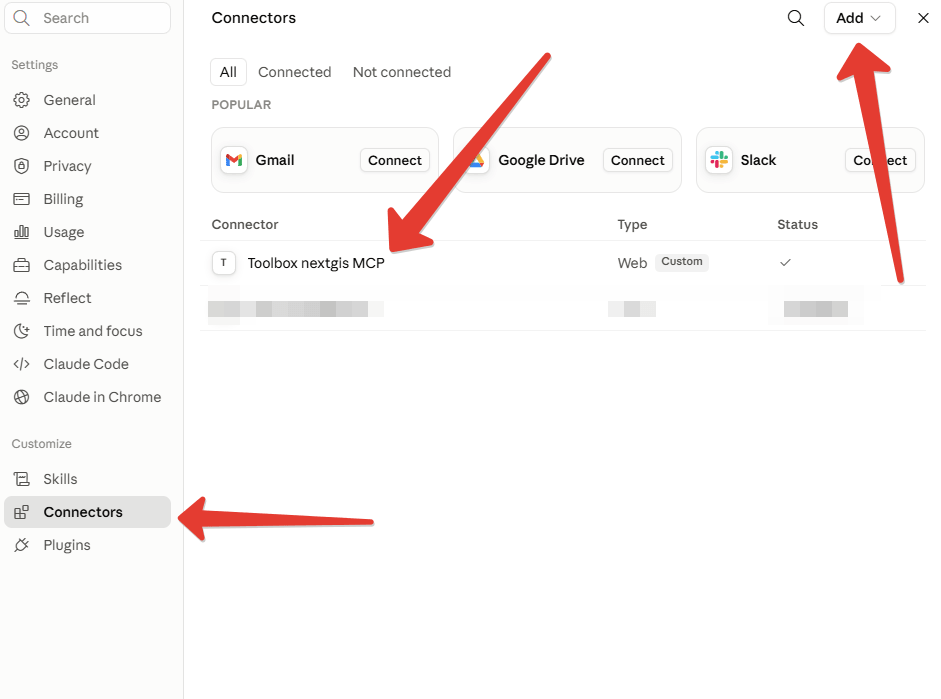
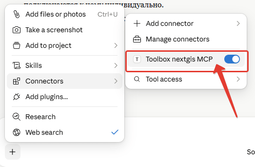
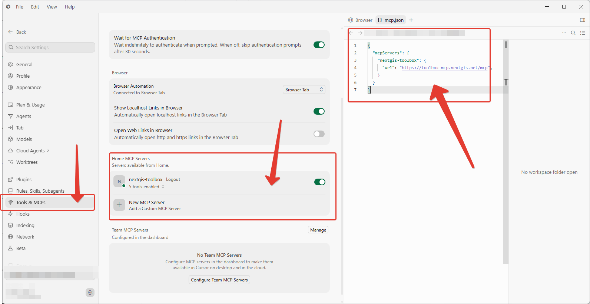
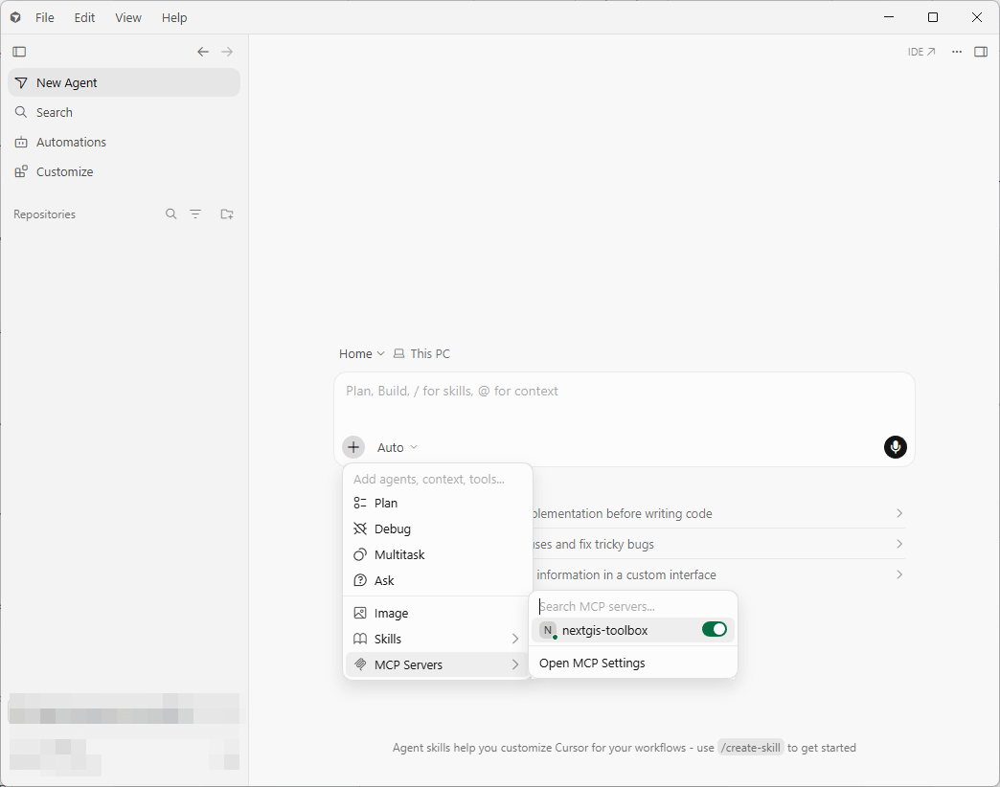

Использование через MCP
==============================================

Вы можете добавить в настройках своей нейросети MCP-сервер NextGIS Toolbox и решать свои геоинформационные задачи прямо в чате.

1. Войдите в аккаунт, чтобы получить персональную MCP-ссылку. Она будет выглядеть так::

   https://mcp.toolbox.nextgis.com/mcp?api_key=APIKEY

Вместо ``APIKEY`` будет ваш личный ключ.

2. Подключите эту ссылку в свой клиент. Как именно это нужно сделать, зависит от конкретной LLM. 

.. contents::
   :local:
   :depth: 1

.. note:: Если вы не видите в списке своей любимой LLM - попробуйте подключить в неё ссылку и поделитесь с нами инструкцией, как вы это сделали, мы добавим её в документацию.

3. Пишите запросы как обычно.

Примеры запросов:

1. Compute NDVI for Blanes, Spain for October 2024 using Sentinel-2 imagery. If multiple satellite tiles cover the area, just pick one (scene) arbitrarily. Use MCP.
2. Нужна высота н.у.м поселка Барвиха по ALOS. Используй MCP

Возможности работы через MCP постоянно расширяются, в настоящий момент модели, на которых проводилось тестирование, могут самостоятельно получать данные из внешних источников, запускать инструменты для их обработки и создавать веб-карты. ChatGPT также может загружать файлы с вашего устройства для их последующей обработки с помощью Toolbox MCP.

.. _chatgpt_web:

ChatGPT (веб-версия)
---------------------

Нажмите на профиль и выберите Settings --> Plugins --> Browse plugins.

Нажмите **+** рядом с поиском справа вверху.

Включите Developer mode - ON.

Нажмите **Create app** и введите:

* любое название, например, Toolbox MCP.
* В поле **Connection** вставьте ссылку на MCP.
* Authentification: No auth.

Также необходимо принять предупреждения.

..note:: Для работы нужна подписка Plus и выше.

.. _claude_web:

Claude (веб-версия)
-------------------

* Откройте настройки — нажмите **«Customize»** (или значок настроек) в левой боковой панели, затем выберите раздел **«Connectors»**.
* Добавьте новый коннектор — нажмите **«+»**, выберите **«Add custom connector»**. Free-пользователи ограничены одним кастомным коннектором.
* Укажите URL сервера — вставьте адрес удалённого MCP-сервера NextGIS Toolbox.
* Нажмите **«Add»** — коннектор появится в списке ваших подключенных сервисов.

* Включите коннектор в чате. В нужном разговоре нажмите **«+»** внизу окна чата → **«Connectors»** и включите переключатель напротив NextGIS Toolbox.

После этого Claude сможет вызывать инструменты NextGIS Toolbox (поиск спутниковых снимков, расчёт NDVI и т.д.) прямо в разговоре.

.. _claude_code:

Claude Code
-----------

Через Терминал внутри проекта, где хотите добавить MCP, используйте команду::

   claude mcp add --transport http toolbox-mcp https://mcp.toolbox.nextgis.com/mcp?api_key=APIKEY

Затем запустите claude и наберите команду ``/mcp``. В списке Local MCPs будет видно toolbox-mcp.

Пользуйтесь.

Для глобального использования запустите команду::

   claude mcp add --transport http --scope global toolbox-mcp https://mcp.toolbox.nextgis.com/mcp?api_key=APIKEY 

.. _cursor_ide:

Cursor IDE
----------

Откройте Cursor Settings.

В левом меню выберите раздел Tools & MCPs.

В блоке Home MCP Servers нажмите «New MCP Server» (карточка с иконкой «+» и подписью «Add a Custom MCP Server»).

Откроется файл mcp.json, впишите туда сервер вручную.

.. code_block::

    {
    "mcpServers": {
        "nextgis-toolbox": {
        "url": "https://toolbox-mcp.nextgis.net/mcp",
        }
    }
    }

После сохранения сервер появится карточкой в списке Home MCP Servers.

При использовании и написании запросов убедитесь, что MCP сервер включен (см. скриншот ниже).

