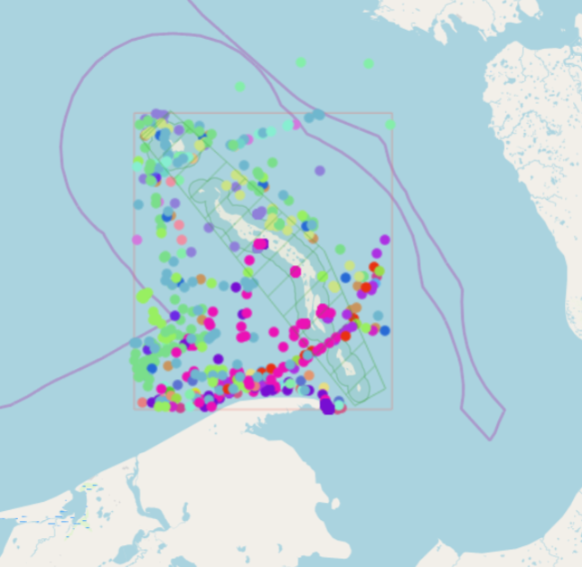
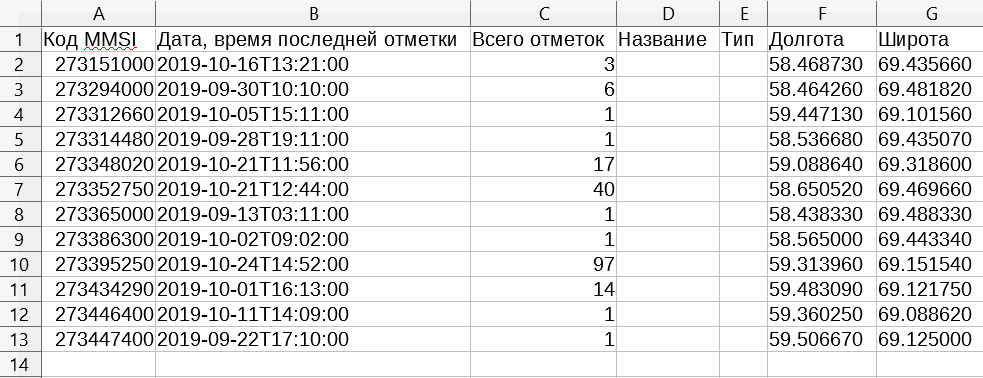

Отчет о судах в зоне
====================

Этот инструмент генерирует таблицу (формат - Excel), в которой перечислены суда, заплывающие на заданную территорию, название и тип судна, дата и координаты их последнего места пребывания, а также количество заходов судов на заданную территорию за определенный промежуток времени. Этот инструмент имеет смысл если у вас уже настроен сервис обновляющий данных о локациях судов в вашей Веб ГИС.

На входе:

* Адрес Веб гис - url-адрес вашей Веб ГИС (например http(s)://mywebgis.nextgis.com);
* Логин - NextGIS ID или имя пользователя, имеющего права на запись данных в указанный ресурс;
* Пароль - Пароль пользователя в Веб ГИС;
* ID ресурса зоны  - ID полигонального слоя в Веб ГИС;
* ID ресурса данных о судах - ID точечного слоя в Веб ГИС;
* Начальная дата - Дата, начиная с которой отбираются встречи судов (например, 2019-09-22).

Алгоритм расчета: Загрузка слоев границы зоны анализа и локаций судов. Проверка каждой локации на вхождение в зону анализа, также отбираются локации зарегистрированные позже заданной стартовой даты. Среди отобранных локаций по каждому судну получается последняя локация и ее координаты, а также общее количество локаций. Полученная иформация для каждого судна записывается в таблицу. 

Результатом работы процесса является таблица в формате Excel с информацией о всех судах, зарегистрированных на заданной территории позднее заданной даты, информация о последней зарегистрированной локации и количестве зарегистрированных локаций в пределах заданной территории за определенный промежуток времени.

Запуск инструмента: https://toolbox.nextgis.com/t/mt2report

   
   Пример исходных данных 
   

   
   Пример результата работы инструмента

**Попробуйте инструмент в действии**

1. Нажмите кнопку **Демо** над формой инструмента. Поля будут автоматически заполнены демонстрационными значениями.
2. Нажмите кнопку **Запустить**.
