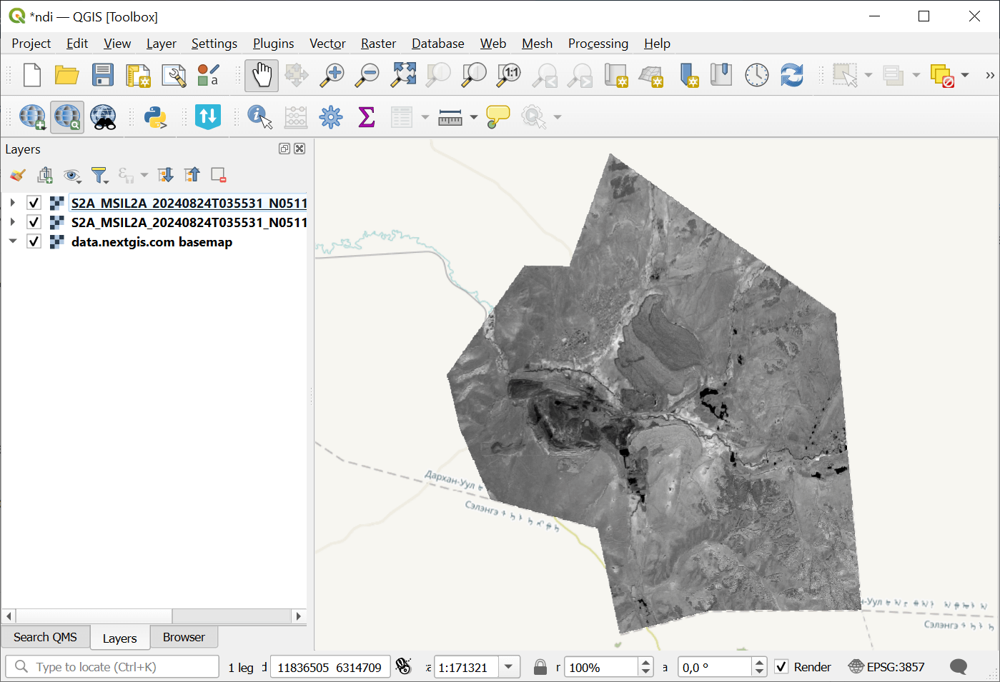
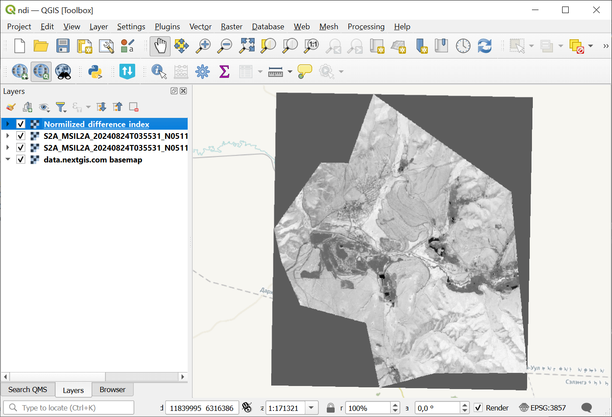

Normalized difference index
===========================

The tool calculates the normalized difference index for any two input images.

Inputs:

GDAL-supported rasters (the first band will be used for the calculations).

* First raster. First measurement for the NDVI calculation, e.g. NIR band;
* Second raster. Second measurement for the NDI calculation, e.g. red band.

Outputs:

* A raster with normalized difference index in GeoTiff format.

The calculation is carried out according to the formula: (First image - Second image) / (First image + Second image). The pixel values of the resulting raster are in the range from -1 to 1
Before the calculation, both images are brought into a single spatial domain. The projection and spatial resolution of the first raster is used.

Examples of common normalized difference indices:

* NDVI - for vegetation assessment (the first raster - NIR, the second - RED) For Landsat 8 data: 5 and 4 bands.
* NDWI - for the detection of water bodies (the first raster - NIR, the second - SWIR). For Landsat 8 data: 5 and 6 bands.
* NDSI - for assessing the snow cover (the first raster - GREEN, the second - SWIR). For Landsat 8 data: 3 and 6 bands.

Example:

   Example input

   Example output

Launch the tool: https://toolbox.nextgis.com/t/ndi

**Try the tool in action**

1. Click on the **Demo** button above the tool form. The fields are filled in with demo values.
2. Click on the **Run** button.

.. admonition:: Related tools

   * `Prepare and download Sentinel-2 data <https://toolbox.nextgis.com/t/download_and_prepare_l8_s2?from-related-tools=1>`_
   * `Search and save Sentinel-2 scene previews <https://toolbox.nextgis.com/t/s2_search?from-related-tools=1>`_
   * `Landsat reflectance calculation <https://toolbox.nextgis.com/t/landsat_to_reflectance?from-related-tools=1>`_
   * `Raster calculator (GDAL) <https://toolbox.nextgis.com/t/raster_calculator?from-related-tools=1>`_