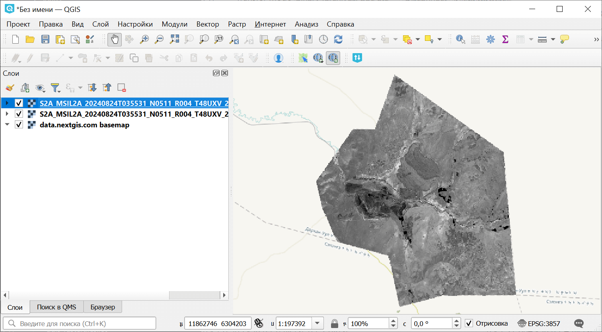
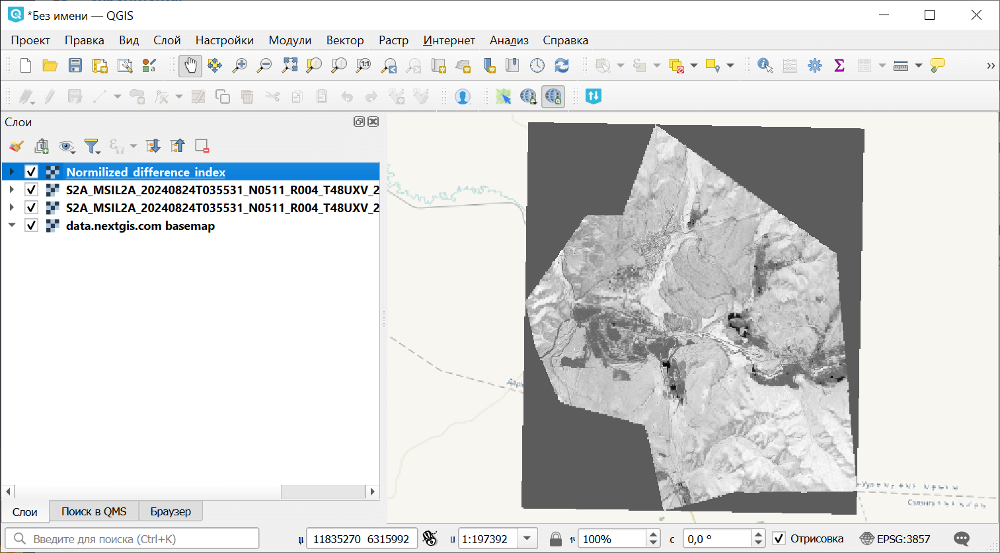

Расчет нормализованного разностного индекса
===========================================

Инструмент осуществляет расчет нормализованного разностного индекса для двух любых входных изображений.

На входе:

GDAL-поддерживаемые растры (для расчёта будет использован первый канал)

* Первый растр. Первый участник формулы расчёта НРИ. Например ближний ИК диапазон для NDVI;
* Второй растр. Второй участник формулы расчёта НРИ. Например красный диапазон для NDVI.

На выходе:

* Растр с нормализованных разностным индексом в формате GeoTiff.

Расчет осуществляется по формуле: (Первый растр - Второй растр) / (Первый растр + Второй растр). Значения пикселей результирующего растра находятся в диапазоне от -1 до 1.

Перед расчётом оба изображения приводятся в единый пространственный домен. Используется проекция и пространственное разрешение первого растра.

Примеры распространенных нормализованных разностных индексов:

* NDVI - для оценки растительности (первый растр - съемка в ближнем инфракрасном диапазоне, второй - в красном диапазоне длин волн).  Для данных Landsat 8: 5 и 4 каналы.
* NDWI - для обнаружения водных объектов (первый растр - съемка в ближнем инфракрасном диапазоне, второй - в среднем инфракрасном диапазоне длин волн). Для данных Landsat 8: 5 и 6 каналы.
* NDSI - для оценки снежного покрова (первый растр - съёмка в зеленом диапазоне, второй - в среднем инфракрасном диапазоне длин волн). Для данных Landsat 8: 3 и 6 каналы.

Пример работы инструмента:

   Пример исходных данных

   Пример результата работы инструмента

Запуск инструмента: https://toolbox.nextgis.com/t/ndi

**Попробуйте инструмент в действии, скачав наш пример:**

`Набор исходных данных <https://nextgis.ru/data/toolbox/ndi/ndi_inputs_ru.zip>`_ для проверки работы инструмента. Внутри архива пошаговая инструкция.

`Пример результата <https://nextgis.ru/data/toolbox/ndi/ndi_outputs_ru.zip>`_ работы инструмента.

.. seealso::

    * `Подготовка и скачивание данных Sentinel-2 <https://toolbox.nextgis.com/t/download_and_prepare_l8_s2?from-related-tools=1>`_
    * `Cцены Sentinel-2 в GPKG <https://toolbox.nextgis.com/t/s2_search?from-related-tools=1>`_
    * `Расчёт спектрального альбедо объектов по данным Landsat <https://toolbox.nextgis.com/t/landsat_to_reflectance?from-related-tools=1>`_
    * `Калькулятор растров (GDAL) <https://toolbox.nextgis.com/t/raster_calculator?from-related-tools=1>`_