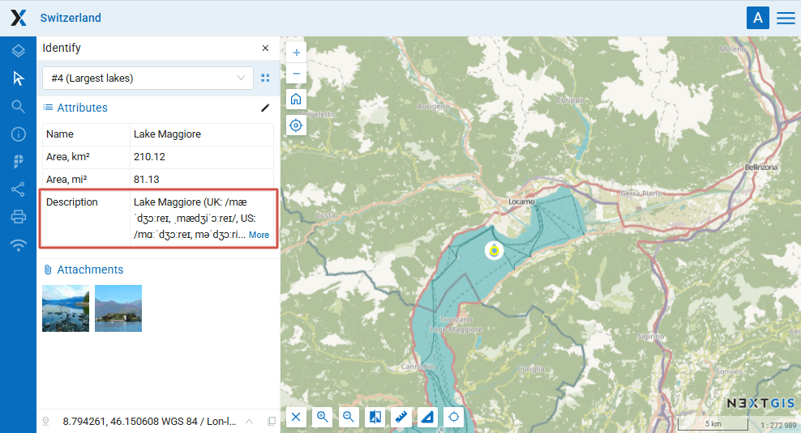
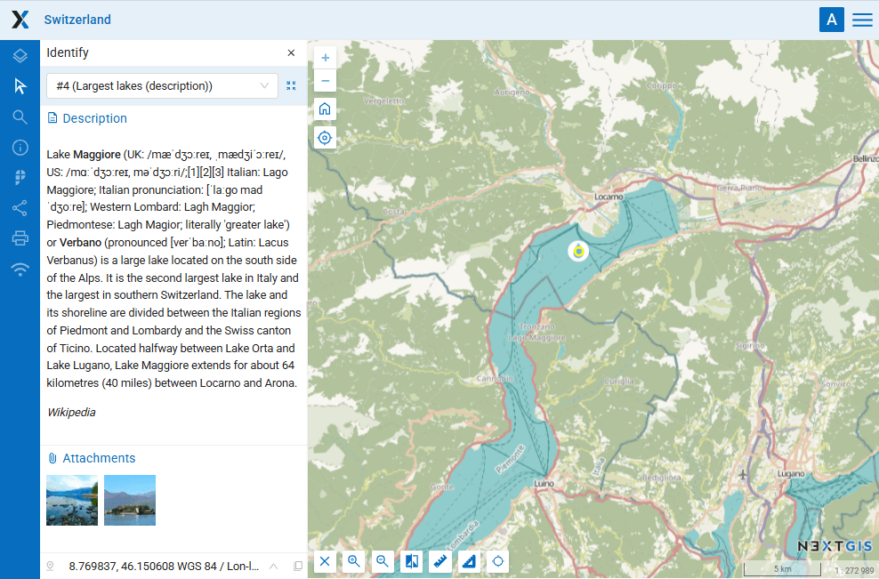

Attribute to description for Web GIS
====================================

If you have long texts describing layer features it is more handy to have them in the description instead of an attribtute field. This tool allows to create descriptions for all the features of the layer by copying text from a selected field.

The tool replaces current description. If the selected attribute is empty, the feature is skipped.

Inputs:

* Web GIS address - URL of your Web GIS, e.g. https://demo.nextgis.com and credentials, if necessary: NextGIS ID and password;
* Layer ID - numbers at the end of the layer's URL;
* Attribute name - enter name of the field from which the description text is to be copied;
* Erase descriptions - tick to remove descriptions for all features.

Outputs:

* Link to the modified Web GIS layer.

Launch the tool: https://toolbox.nextgis.com/t/ngw_attribute2description

Example:

   Long text in an attribute field partially displayed

   The same text in the description is displayed in full

**Try the tool in action**

1. Click on the **Demo** button above the tool form. The fields are filled in with demo values.
2. Click on the **Run** button.

.. admonition:: Related tools

  * `Vector layers from Web GIS to GeoPackage <https://toolbox.nextgis.com/t/ngw_to_gpkg?from-related-tools=1>`_
  * `Change attributes in layer group <https://toolbox.nextgis.com/t/field_value_changer?from-related-tools=1>`_
  * `Join layer and table by field <https://toolbox.nextgis.com/t/join_by_field?from-related-tools=1>`_
  * `Photos with EXIF to a Web GIS layer <https://toolbox.nextgis.com/t/exif2resource?from-related-tools=1>`_