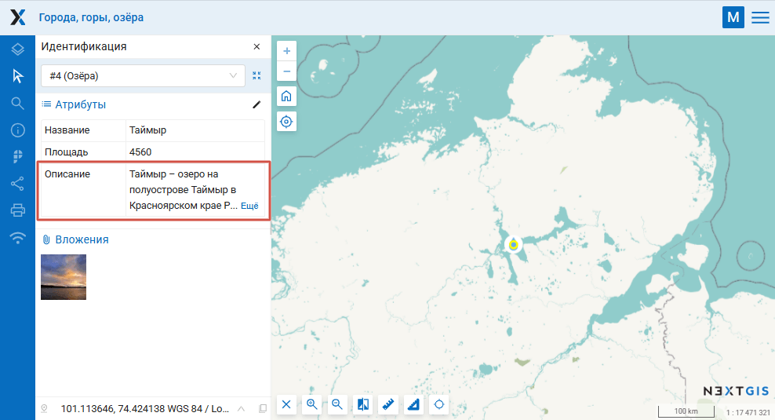
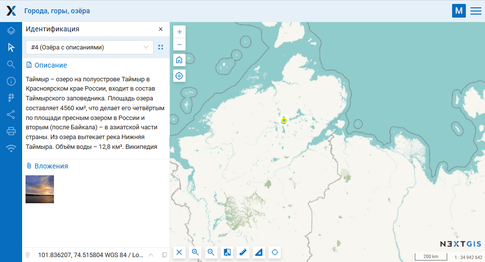

Атрибут в описание для Веб ГИС
==============================

При создании веб-карты может быть удобнее отображать длинные текстовые описания объектов в описании, а не в таблице атрибутов. Инструмент позволяет массово создать такие описания для всех объектов слоя.

Инструмент копирует значение выбранного атрибута векторного слоя Веб ГИС в описание объекта, которое отображается при идентификации и предпросмотре объекта. Заменяет текущее описание. Объекты, у которых выбранный атрибут не заполнен, пропускаются.

На входе:

* Адрес Веб ГИС - Ссылка на Веб ГИС на платформе NextGIS Web вида https://demo.nextgis.com и данные для входа, если необходимо: NextGIS ID и пароь;
* ID слоя - цифры в конце ссылки на ресурс векторного слоя;
* Имя атрибута - укажите название поля, из которого будет скопирован текст описания.

На выходе:

* Ссылка на обновлённый слой в Веб ГИС.

Запуск инструмента: https://toolbox.nextgis.com/t/ngw_attribute2description

Пример работы инструмента:

   Длинный текст в одном из полей показывается частично

   Текст перенесён в описание и отображается весь, независимо от длины

**Попробуйте инструмент в действии, скачав наш пример:**

1. Нажмите кнопку **Демо** над формой инструмента. Поля будут автоматически заполнены демонстрационными значениями.
2. Нажмите кнопку **Запустить**.

.. admonition:: Связанные инструменты

   * `Векторные слои из Веб ГИС в GeoPackage <https://toolbox.nextgis.com/t/ngw_to_gpkg?from-related-tools=1>`_
   * `Изменение атрибутов в группе слоев <https://toolbox.nextgis.com/t/field_value_changer?from-related-tools=1>`_
   * `Объединение слоя и таблицы по полю <https://toolbox.nextgis.com/t/join_by_field?from-related-tools=1>`_
   * `Фото с EXIF в слой Веб ГИС <https://toolbox.nextgis.com/t/exif2resource?from-related-tools=1>`_

